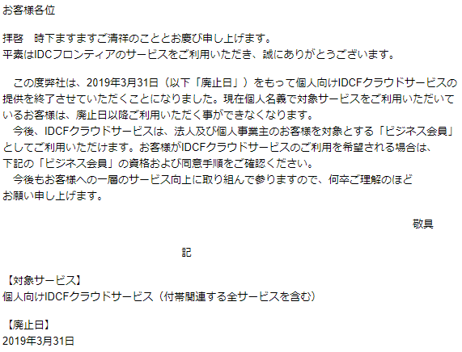

IDCF Cloud が個人向けサービスを終了する
-------------------------

IDCF Cloud の個人向けサービスが終了することとなりました。これまで IDCF Cloud の500円/月サーバーで WordPress を運用していたため、他のクラウドサービスなどへ移す必要がでてきました。まあ、みんな500円インスタンスだけつかって儲からないとか、脆弱性放置で乗っ取られるとかありそうだからね。



引越し先選定
------

時代はコンテナだし、Kubernetes の勉強がてら出たばかりの [DigitalOcean](https://m.do.co/c/97e74a2e7336) の [Managed Kubernetes](https://www.digitalocean.com/products/kubernetes/) を使って構築しようかとも思ったのだけれど、最小インスタンス1つだけで $10/月 かかり、Load Balancer でさらに $10/月、加えて Block storage も必要になります。これはちょっと高すぎだなあということで、[AWS Lightsail](https://aws.amazon.com/jp/lightsail/) の $3.5/月インスタンスを使うことにしました。CloudFront は以前から導入済みでした。DigitalOcean の Kubernetes は日本から一番近いシンガポールリージョンではまだ提供されていない（まだ Beta だしね）という理由もあります。



Lightsail には他の VPC サービスの様な（あ、EC2 にもありますね）アプリインストール済みイメージも選択可能なのでここから WordPress を選択します。Version が 4.9.8 となっていますが、起動後に更新可能です。



Lightsail の WordPress は Bitnami のパッケージが使われています。([Get Started With Bitnami Applications Using Amazon Lightsail](https://docs.bitnami.com/aws/get-started-lightsail/))

データ移行
-----

移行元の WordPress で Tools → Export で All content を選択して Export し、新しい WordPress で Tools → Import で [WordPress Importer](https://wordpress.org/plugins/wordpress-importer/) をインストールして取り込むだけです。画像も直接旧サイトから取り込んでくれます。 ということなのでインポートをする時点では DNS や CloudFront の Origin サイトを切り替えたりしてはいけませんん。

Bitnami の WordPress を使うにあたっていじったところのメモ
--------------------------------------

### mod\_expires 設定

`/opt/bitnami/apache2/conf/expires.conf` を次の内容で作成。

```ApacheConf
<IfModule mod_expires.c>
    ExpiresActive On
    ExpiresByType image/jpg "access 1 year"
    ExpiresByType image/jpeg "access 1 year"
    ExpiresByType image/gif "access 1 year"
    ExpiresByType image/png "access 1 year"
    ExpiresByType text/css "access 1 month"
    ExpiresByType application/pdf "access 1 month"
    ExpiresByType text/x-javascript "access 1 month"
    ExpiresByType application/x-shockwave-flash "access 1 month"
    ExpiresByType image/x-icon "access 1 year"
    ExpiresDefault "access 2 days"
</IfModule>
```

`/opt/bitnami/apache2/conf/httpd.conf` でコメントアウトされている行をアンコメントします。

```ApacheConf
#LoadModule expires_module modules/mod_expires.so
↓
LoadModule expires_module modules/mod_expires.so
```

先程作成した `expires.conf` を Include する。

```ApacheConf
Include conf/expires.conf
```

を `/opt/bitnami/apache2/conf/httpd.conf` の末尾に追加。 Apache の再起動

```bash
sudo /opt/bitnami/ctlscript.sh restart apache
```

### mod\_pagespeed の無効化

mod\_expires 設定を行っても mod\_pagespeed が

```
Cache-Control: max-age=0, no-cache, s-maxage=10
```

をセットしてしまうので無効にする。 `/opt/bitnami/apache2/conf/httpd.conf` の当該行をコメントアウト。

```ApacheConf
Include conf/pagespeed.conf
Include conf/pagespeed_libraries.conf
↓
#Include conf/pagespeed.conf
#Include conf/pagespeed_libraries.conf
```

Apache の再起動

```bash
sudo /opt/bitnami/ctlscript.sh restart apache
```

### php.ini の変更

`/opt/bitnami/php/etc/php.ini` にあるので変更の必要があればここを書き換えて wordpress の再起動

```bash
/opt/bitnami/ctlscript.sh restart php-fpm
```

Response Header に PHP の Version を入れたくない場合は `expose_php` を `Off` にする。

```ini
expose_php = Off
```

### https 対応

`/opt/bitnami/apps/wordpress/htdocs/wp-config.php` の `WP_SITEURL`, `WP_HOME` を `https` に変更

```php
define('WP_SITEURL', 'http://' . $_SERVER['HTTP_HOST'] . '/');
define('WP_HOME', 'http://' . $_SERVER['HTTP_HOST'] . '/');
↓
define('WP_SITEURL', 'https://' . $_SERVER['HTTP_HOST'] . '/');
define('WP_HOME', 'https://' . $_SERVER['HTTP_HOST'] . '/');
```

この行の下に CloudFront 版の `X-Forwarded-Proto` 対応設定を挿入

```php
if (strpos($_SERVER['HTTP_CLOUDFRONT_FORWARDED_PROTO'], 'https') !== false)
    $_SERVER['HTTPS']='on';
```

WordPress の再起動

```bash
/opt/bitnami/ctlscript.sh restart php-fpm
```

CloudFront を使って困ること
-------------------

WordPress の preview は通常の URL に QUERY STRING がついているだけなので、投稿のプレビューができない or キャッシュされて機能しないという状況に陥ります。 URL の path にプレビュー用の prefix を入れるプラグインとかないかな？

[https://gist.github.com/wokamoto/ecfd3a7ea9ef80ea1628](https://gist.github.com/wokamoto/ecfd3a7ea9ef80ea1628) というのは見つけたけど。

現状は投稿する PC では hosts でサーバーに直接アクセスするようにして回避しています。

### サーバー直でも https でアクセスできるようにする

サーバーに直接アクセスするために Apache にも TLS の証明書をセットする必要があります。`/opt/bitnami/apache2/conf/bitnami/bitnami.conf` に

```ApacheConf
SSLCertificateFile "/opt/bitnami/apache2/conf/server.crt"
SSLCertificateKeyFile "/opt/bitnami/apache2/conf/server.key"
```

とあるのでここに Let's Encrypt で取得した証明書と鍵をコピペして apache を再起動します。

```bash
sudo /opt/bitnami/ctlscript.sh restart apache
```

DNS は Route53 を使っているため Let's Encrypt の証明書は [lego](https://github.com/go-acme/lego) で次のようにして取得することがます。

```bash
lego \
  --domains blog.1q77.com \
  --accept-tos \
  --path . \
  --email 自分のメールアドレス \
  --dns route53 \
  --pem \
  run
```

データのバックアップ
----------

Lightsail インスタンスはスナップショットを作成することができます。 [https://github.com/amazon-archives/lightsail-auto-snapshots](https://github.com/amazon-archives/lightsail-auto-snapshots) という SAM を使った Lambda Function で自動化する方法があるようです

追記  
「[AWS Lightsail の snapshot 取得を自動化する](/2019/05/aws-lightsail-auto-snapshots/)」に上記の Lambda を使って自動化する手順を書きました。
