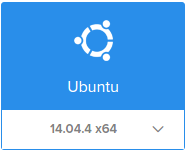

Docker の実行環境としてどれがいいかな？と Swarm や Mesos などを試している（今後は Kubernetes や Nomad も試してみたい）が手元の PC の Virtualbox だけではリソースが足りないため DigitalOcean を使うことにしたのだが、Global IP Address 側でクラスタ通信させるのも気持ちが悪いので Private Network を使い、PC からも直接そのセグメントにアクセスしたいので OpenVPN で接続することにしたのでそのメモ。 かつて CentOS で OpenVPN サーバーをセットアップし、人（証明書）によって違うセグメントを割り当てたり、固定IPを割り振ったり Windows クライアントのセットアップを行ったりしたことはあるが遠い昔の記憶だ。 今回は [How To Set Up an OpenVPN Server on Ubuntu 14.04](https://www.digitalocean.com/community/tutorials/how-to-set-up-an-openvpn-server-on-ubuntu-14-04) を参考にセットアップしてみる。 ほぼ丸写しするだけでできるけど... クライアントは ubuntu PC である。こちらは

```
sudo apt-get install network-manager-openvpn
```

した後、GUI でちょちょっと設定するだけで使える。楽ちん。 それではサーバーのセットアップ

### Droplet (VM) の作成

$5/月のサーバーを作成、リージョンは一番近いシンガポールを選択






### OpenVPN のインストール

サーバーが起動したら SSH でログインして OpenVPN をインストールする リポジトリ情報の更新

```
apt-get update
```

OpenVPN と Easy-RSA をインストール

```
apt-get install openvpn easy-rsa
```

### OpenVPN サーバーの設定

設定例が一緒にインストールされているのでこれを土台にする

```
zcat /usr/share/doc/openvpn/examples/sample-config-files/server.conf.gz > /etc/openvpn/server.conf
```

dhparam は今時は 1024 では短いので 2048 に変更

```
# Diffie hellman parameters.
# Generate your own with:
#   openssl dhparam -out dh1024.pem 1024
# Substitute 2048 for 1024 if you are using
# 2048 bit keys.
```

```
sed -i -e 's/^dh.\*/dh dh2048.pem/' /etc/openvpn/server.conf
openssl dhparam -out /etc/openvpn/dh2048.pem 2048
```

クライアントの Default Gateway を VPN に向けたいなら

```
;push "redirect-gateway def1 bypass-dhcp"
```

をアンコメントするらしいが、クライアントの設定にも依存するようだ。 この設定がなくてもクライアントが route を設定すればそうなるし、そうしなければそうならない。 今回の用途では不要。 VPN 接続時に DNS サーバーを切り替えさせたいなら

```
;push "dhcp-option DNS 208.67.222.222"
;push "dhcp-option DNS 208.67.220.220"
```

をアンコメントして DNS サーバーのアドレスを実際のものに書き換えます。 これも今回はやらない 実行ユーザーを非特権ユーザーにするため、次の行をアンコメントする

```
;user nobody
;group nogroup
```

追加の routing を設定 DigitalOcean の Private Network は `10.130.0.0/16` のようなので

```
push "route 10.130.0.0 255.255.0.0"
```

を追記 VPN で使われるネットワークセグメントは次の設定によって決まっており

```
# Configure server mode and supply a VPN subnet
# for OpenVPN to draw client addresses from.
# The server will take 10.8.0.1 for itself,
# the rest will be made available to clients.
# Each client will be able to reach the server
# on 10.8.0.1. Comment this line out if you are
# ethernet bridging. See the man page for more info.
server 10.8.0.0 255.255.255.0
```

サーバーは 10.8.0.1 を使うことになり、残りからクライアント側に払い出される セキュリティをより強化するために TLS-AUTH の設定を行います。

```
# For extra security beyond that provided
# by SSL/TLS, create an "HMAC firewall"
# to help block DoS attacks and UDP port flooding.
#
# Generate with:
#   openvpn --genkey --secret ta.key
#
# The server and each client must have
# a copy of this key.
# The second parameter should be '0'
# on the server and '1' on the clients.
;tls-auth ta.key 0 # This file is secret
```

次のコマンドで鍵を作成します

```
openvpn --genkey --secret /etc/openvpn/ta.key
```

tls-auth にこの鍵を指定します、鍵の次の値はサーバ側が 0 でクライアントは 1 を指定します

```
sed -i -r -e 's/^;?tls-auth.*/tls-auth ta.key 0/' /etc/openvpn/server.conf
```

使われる cipher をよりセキュアなものにする

```
# Select a cryptographic cipher.
# This config item must be copied to
# the client config file as well.
;cipher BF-CBC        # Blowfish (default)
;cipher AES-128-CBC   # AES
;cipher DES-EDE3-CBC  # Triple-DES
```

```
sed -i -r -e 's/^;?cipher AES-128-CBC.*/cipher AES-128-CBC/' /etc/openvpn/server.conf
```

### Packet の forwarding を有効にする

```
sysctl -w net.ipv4.ip_forward=1
```

再起動しても設定されるように /etc/sysctl.conf にも設定しておく

```
sed -i -e 's/^#?net.ipv4.ip_forward.*/net.ipv4.ip_forward=1/' /etc/sysctl.conf
```

### Firewall (UFW) の設定

SSH は許可する

```
ufw allow ssh
```

OpenVPN で使うポートも許可する

```
ufw allow 1194/udp
```

forwarding を許可する

```
sed -e 's/DEFAULT_FORWARD_POLICY=.*/DEFAULT_FORWARD_POLICY="ACCEPT"/' /etc/default/ufw
```

NAT 設定 `/etc/ufw/before.rules` の `*filter` 設定の手前に次の設定を入れる

```
# START OPENVPN RULES
# NAT table rules
*nat
:POSTROUTING ACCEPT [0:0] 
# Allow traffic from OpenVPN client to eth0
-A POSTROUTING -s 10.8.0.0/8 -o eth0 -j MASQUERADE
# Allow traffic from OpenVPN client to eth1
-A POSTROUTING -s 10.8.0.0/8 -o eth1 -j MASQUERADE
COMMIT
# END OPENVPN RULES
```

通常は Internet 側の eth0 だけで良いかもしれないが、今回はこの VPN サーバーも必要なときにしか起動させない（snapshot を取っておいて destroy する）ため都度 IP アドレスが変わる予定で、Private Network 内での routing 設定に困るので eth1 (private 側) も NAT させます。 ufw を有効にする

```
ufw enable
```

確認

```
ufw status
```

NAT の確認

```
iptables -t nat -vnL
```

### 証明書まわりの設定

Easy-RSA のスクリプトを openvpn 用にコピーする

```
cp -r /usr/share/easy-rsa/ /etc/openvpn
```

key を置くディレクトリの作成

```
mkdir /etc/openvpn/easy-rsa/keys
```

`/etc/openvpn/easy-rsa/vars` ファイルを編集する。 openssl コマンド実行時のデフォルト値を設定する

```
vim /etc/openvpn/easy-rsa/vars
```

適当にそれらしく設定しておきます（個人でやってるぶんにはどーでもいい）

```
export KEY_COUNTRY="JP"
export KEY_PROVINCE="Tokyo"
export KEY_CITY="Minato-ku"
export KEY_ORG="My Company Name"
export KEY_EMAIL="momotaro@example.com"
export KEY_OU=""
```

サーバー用の鍵や証明書は `server.key`, `server.crt` と `/etc/openvpn/server.conf` で指定してあるので

```
export KEY_NAME="server"
```

も設定しておく スクリプトが期待通りにどうさするよう、ディレクトリを移動

```
cd /etc/openvpn/easy-rsa
```

変数の読み込み

```
. ./vars
```

初回は念の為掃除

```
./clean-all
```

`ca.crt` を作成する

```
./build-ca
```

サーバー用のキーペアを作成する

```
./build-key-server server
```

yes/no を聞かれる場合は yes (y) を、それ以外は Enter で。 keys ディレクトリ内に `server.crt`, `server.key`, `ca.crt` ができているので `/etc/openvpn/` にコピーする

```
cp /etc/openvpn/easy-rsa/keys/{server.crt,server.key,ca.crt} /etc/openvpn
```

サーバー側はこれで完了 起動させる

```
service openvpn start
service openvpn status
```

### クライアント用の証明書作成

```
cd /etc/openvpn/easy-rsa
```

ここでは client1 という Common Name で作成しようとしている。 どの（だれの）端末だかわかるような名前をつけましょう

```
./build-key client1
```

これで `/etc/openvpn/easy-rsa/keys/client1.crt`, `/etc/openvpn/easy-rsa/keys/client1.key` ができたので `/etc/openvpn/ca.crt`, `/etc/openvpn/ta.key` とともにクライアント側にコピーして、後はクライアント側の設定を行います。

### クライアント設定 (ubuntu)

ノートPCの ubuntu での設定例です。 最初にも書いたが network-manager-openvpn をインストールします

```
sudo apt-get install network-manager-openvpn
```

















### スマホからの接続

後で Android からの接続を試してみよう。 試してみました [OpenVPN for Android](https://play.google.com/store/apps/details?id=de.blinkt.openvpn&hl=ja) がスマホで設定できて便利でした。 [OpenVPN Connect](https://play.google.com/store/apps/details?id=net.openvpn.openvpn&hl=ja) は設定ファイルを作ってインポートして上げる必要があるみたいです。
