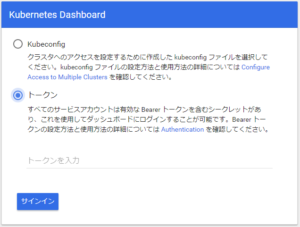
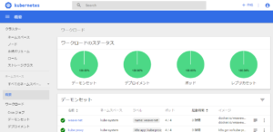

[kubeadm](https://github.com/kubernetes/kubeadm) を使って HA な Kubernetes を構築するというのを 1.11 の時に試して Ansible Playbook にしたりしていましたが、kubeadm が GA になったことだし 1.13 での手順に更新してみた([github.com/yteraoka/do-k8s-stacked-etcd](https://github.com/yteraoka/do-k8s-stacked-etcd))。etcd 同居タイプです。

* [CentOS 7 に kubeadm をインストール](/2018/08/install-kubeadm-on-centos7/)
* [kubeadm で外部 etcd で HA な Kubernetes クラスタをセットアップする](/2018/08/creating-highly-available-clusters-with-kubeadm/)
* [etcd stacked Highly Available Kubernetes cluster を Ansible でセットアップ](/2018/08/etcd-stacked-highly-available-kubernetes-cluster/)
* [外部 etcd な Kubernetes を DigitalOcean に構築する Ansible Playbook](/2018/08/do-k8s-external-etcd/)

[Production-Ready Kubernetes Cluster Creation with kubeadm](https://kubernetes.io/blog/2018/12/04/production-ready-kubernetes-cluster-creation-with-kubeadm/)

サーバーの準備
-------

いつもながら [DigitalOcean](https://m.do.co/c/97e74a2e7336) に Control Plane 用サーバー3台と Worker 用サーバー1台を作ります。

* CentOS 7 のサーバー4台
* API サーバー用の Load Balancer と DNS レコード

terraform で作れるようになっているので `terraform plan` と `terraform apply` するだけです。

SSH 用の公開鍵は事前に登録されている前提で、`ssh_key_ids` 変数で指定します。DNS のゾーンも事前に作成されてる前提で、`domain_suffix` 変数で指定します。

Ansible Playbook 適用
-------------------

Ansible は 2.7 以降で、[DigitalOcean の Dynamic Inventory](https://github.com/ansible/ansible/blob/devel/contrib/inventory/digital_ocean.py) を使うために Python の `requests` module が必要でした。

kubeadm init で使う config ファイルは etcd 用設定が不要になってました

```
ansible-playbook site.yml -e load_balancer_dns=k8s-api.example.com
```

うまくいけばこれで 3 台の Control Plane サーバーがクラスタ化されます。(なぜか2台目以降の kubeadm join 時に etcd の起動に失敗することがある。原因を調べきれていない)

```
# kubectl get nodes
NAME       STATUS   ROLES    AGE     VERSION
cp1        Ready    master   3h42m   v1.13.1
cp2        Ready    master   3h38m   v1.13.1
cp3        Ready    master   3h37m   v1.13.1
```

Worker node をクラスタに追加する
----------------------

現状はこの後に worker ノードの join 処理を手動で行う必要がある、当該サーバー上で次の様なコマンドを実行することで join させることができる

```
kubeadm join k8s-api.example.com:443 --token e69t47.k98pkcidzvgexwbz \
  --discovery-token-ca-cert-hash \
   sha256:b0e28afb25529ad1405d6adecd4a154ace51b6245ff59477f5ea465e221936de
```

`--token` に渡すのは Control Plane のいずれかのホストで `kubeadm token list` することで確認できる。`--discovery-token-ca-cert-hash` に渡す hash は `/etc/kubernetes/pki/ca.crt` のあるホスト (Control Plane にはある) で次のコマンドを実行することで得られる。

```
openssl x509 -pubkey -in /etc/kubernetes/pki/ca.crt \
  | openssl rsa -pubin -outform der 2>/dev/null \
  | openssl dgst -sha256 -hex | sed 's/^.* //'
```

正常に追加できたら `kubectl get nodes` で確認します。しばらくすると status が Ready になるはず

```
# kubectl get nodes
NAME       STATUS   ROLES    AGE     VERSION
cp1        Ready    master   3h42m   v1.13.1
cp2        Ready    master   3h38m   v1.13.1
cp3        Ready    master   3h37m   v1.13.1
worker-0   Ready    3h30m   v1.13.1 
```

Kubernetes Dashboard のセットアップ
----------------------------

[Dashboard](https://github.com/kubernetes/dashboard) を deploy するには次のコマンドを実行するだけ

```
kubectl apply -f https://raw.githubusercontent.com/kubernetes/dashboard/v1.10.1/src/deploy/recommended/kubernetes-dashboard.yaml
```

上記、recommended の YAML で deploy するとアクセスするためにユーザーを作成して token を入力します。そのためのユーザー作成には次の YAML を `admin-user.yaml` として保存し

```yaml
---
apiVersion: v1
kind: ServiceAccount
metadata:
  name: admin-user
  namespace: kube-system
---
apiVersion: rbac.authorization.k8s.io/v1
kind: ClusterRoleBinding
metadata:
  name: admin-user
roleRef:
  apiGroup: rbac.authorization.k8s.io
  kind: ClusterRole
  name: cluster-admin
subjects:
- kind: ServiceAccount
  name: admin-user
  namespace: kube-system
```

`kubectl apply -f admin-user.yaml` します。次に token を確認します。

```
kubectl -n kube-system describe secret \
  $(kubectl -n kube-system get secret | grep admin-user | awk '{print $1}')
```

これは admin-user を含む secret を grep で取り出していますが、正確な名前を得るには次のようにします。`admin-user` は先ほど作成した ServiceAccount の名前です

```
kubectl get serviceaccounts admin-user -o json -n kube-system | jq -r .secrets[].name
```

Dashboard にクラスタの外からアクセスするためには Ingress を作成して外部へ公開するか kube proxy を使って、クラスタ内へアクセスします。手元の PC からアクセスするために Control Plane のいずれかから `/root/.kube/config` を `~/.kube/config` にコピーして `kubectl proxy` と実行すれば proxy が起動します

```
$ kubectl proxy
Starting to serve on 127.0.0.1:8001
```

これで 127.0.0.1:8001 経由で Dashboard にアクセスできます。[http://localhost:8001/api/v1/namespaces/kube-system/services/https:kubernetes-dashboard:/proxy/](http://localhost:8001/api/v1/namespaces/kube-system/services/https:kubernetes-dashboard:/proxy/)



この画面でトークンを選択して先ほど確認したトークン文字列を入力します



こんな画面が確認できます

課題山積
----

[https://kubernetes.io/docs/setup/independent/high-availability/](https://kubernetes.io/docs/setup/independent/high-availability/) の手順では Weave が使われているが、前回は [Calico](https://docs.projectcalico.org/v3.4/getting-started/kubernetes/) で試したので今回もと思ってやってみたがうまく動作しなかった、辛い。しかし、どれを選ぶのが正解なのだか...

kubeadm join 時に etcd が起動しないことがある問題

トラブったほうが調査で理解が深まるのだけれどなかなか大変...

[Self-hosted](/2018/09/self-hosted-kubernetes/) っていう話もあったなあ

ひとまず [Kubernetes完全ガイド](https://amzn.to/2Farpw5) を読むことにします
