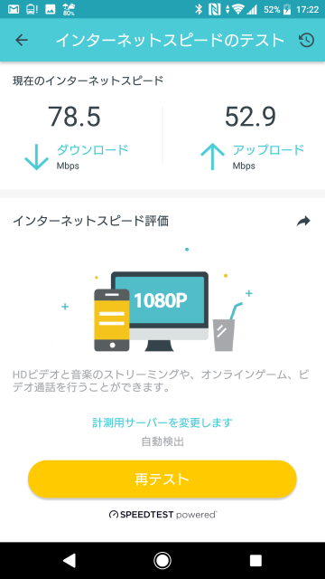
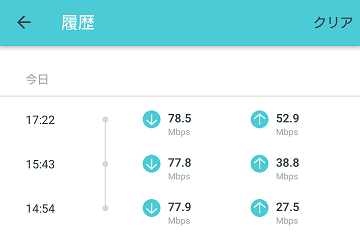

Push 通知が来なくて気づいていませんでしたが。Deco M5 の新しい firmware が[公開](https://www.tp-link.com/jp/support/download/deco-m5/v1/#Firmware)されていたので更新しました。

[ダウンロードサイト](https://www.tp-link.com/jp/support/download/deco-m5/v1/#Firmware)の表記が謎でよくわかりませんが、2つバージョンが上がったみたいです。

* Added switch for SIP ALG feature.
* Added switch for Beamforming feature.
* Added support for IPTV.
* Added Privilege options for manager accounts.
* Optimized the QoS settings.
* Improved the networking stability.
* Enhanced system security.
* Improved total performance.

管理用アプリから見える違いとしては「詳細設定」に「IPTV」、「MACクローン」、「SIP ALG」、「ビームフォーミング」という項目が追加されていました。「ビームフォーミング」はデフォオルトで有効になっていました。

### IPTV

「こちらを有効にすると、メイン Deco の他ポートはIPTVサービスをサポートし使用可能になります。」とあり、IPTV 用の VLAN が追加されるっぽいです。ただし、「IPTV モード」の選択肢が「Singapore-Singtel」、「Malaysia-Unifi」、「Malaysia-Maxis1」、「Malaysia-Maxis2」となっており、日本で使うものではなさそう。

### MAC クローン

ISP によっては特定の MAC アドレスでしか接続できないようになっているらしく、これに対応するための機能のようです。Deco 配下の選択したデバイスの MAC アドレスか指定のカスタム MAC アドレスを使って ISP と通信する機能のようです。日本ではあまり聞きませんね。あ、MAC アドレス制限された LAN に接続するという使い方が・・・

### SIP ALG

「こちらを有効にすると、クライアントは NAT 経由で SIP (セッション開始プロトコル) サーバーと通信できます。」とあります。IP 電話を使う場合にうれしい機能なのかな？

### ビームフォーミング

「ビームフォーミングは接続されたデバイスに WiFi 信号を集中させ、より強い接続を提供いたします。」とあり、デフォルトで有効となっていました。

### アップロード速度が改善した？？

今日は「ソフトバンク光 (フレッツ)」から「auひかり マンションタイプ」に切り替えたのですが、ダウンロード速度はいずれも VDSL の限界っぽい 78Mbps くらいで違いがありませんでした。アップロードは 27Mbps から 38Mbps へと 11Mbps 改善しました。この状態で firmware を更新したら、アップロードがなんと 52Mbps にまで上がりました。「Improved the networking stability」か「Improved total performance」の影響でしょうか。しかし、この計測、Deco のアプリで行っているのだけどスマホからの通信速度なんだろうか Deco からの有線での速度なのだろうか？？

履歴表示

