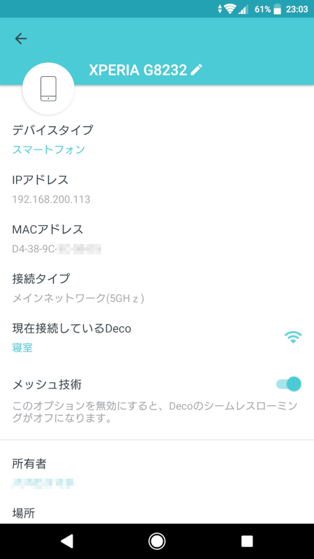
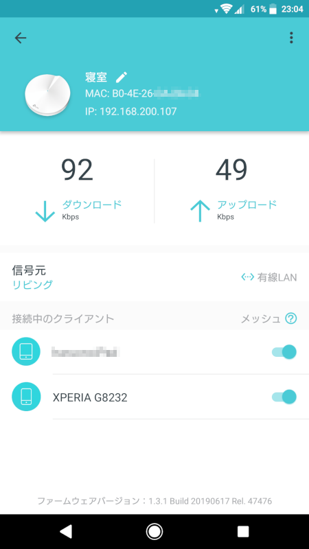

Deco M5 の新しい firmware が公開されていたので更新しました。全然関係なけど今「[TCP 技術入門](https://amzn.to/33ktbUz)」読んでます。

今回の更新内容
-------

### Modifications and Bug Fixes:

1. Added smart home hub feature and supported to manage kasa devices (lights/plugs/switches) and philips hue lights (hue bridge required) in Deco app.
2. Added shortcut and automation features.
3. Displayed which client is connected to which deco and which Wi-Fi band.
4. Displayed how Decos are connected to each other.
5. Added support for IPTV bridge mde and custom mode.
6. Added more options for notification feature.
7. Added IPv6 firewall rules feature.
8. Supported up to 64 entries each for Address Reseervation and Port Forwarding.

### Notes:

1. Please update your Deco App to the latest version in order to use new features.
2. If there are other Deco models in your Deco network, you may miss some new features till other models release updates in the near fu...

最後なぜか省略されてしまっていますが future でしょう。

うれしい更新
------

まあ、うまいこと機能してくれてるのであまり大した意味はないのですが、今回の更新でついにどの端末がどの AP (Deco) に接続されているのかが確認できるようになりました。部屋を移動したときにほんとにちゃんとハンドオーバーされてるのかな？というのが確認できるようになりました。また、どの端末がどの周波数 (2.4GHz なのか 5GHz なのか) で接続しているのかも確認できます。さらに、Deco 同士がどのように接続されているのかも確認できます。これも、導入時に Ethernet Backhaul を設定したのだけれども果たしてそれが意図したとおりになっているのだろうかというのが確認できるようになりました。

### どの AP に接続されているのか

「現在接続されているDeco」という欄に「寝室」とあります。移動前は「リビング」でした。ちゃんと機能しているようです。

### AP にどの端末が接続されているか、AP 同士はどうか

先ほどの「寝室」というところをタップするとその AP (Deco) の情報が確認できます。上位回線と接続されているのはリビングの Deco なので「接続元」が「リビング」となっており、その右に「有線LAN」と表示されており Ethernet Backhaul が機能していることが確認できます。「接続中のクライアント」欄でこの Deco に接続されている端末一覧が確認できます。

その他の機能
------

### オートメーション

わが家に[スマートライト](https://www.tp-link.com/jp/home-networking/smart-bulb/)や[スマートプラグ](https://www.tp-link.com/jp/home-networking/smart-plug/)は無いので使い道がないのですが、特定の端末が接続されたら電源を入れるといったオートメーション設定ができるようになっていました。「自分のスマホが切断されたら照明をOFFにする」とかが出来ると便利なのかな？デバイスなしでも使えるのは「セキュリティの脅威」が検知されたら「通知」するくらいかな？

### ショートカット

こちらも[スマートライト](https://www.tp-link.com/jp/home-networking/smart-bulb/)や[スマートプラグ](https://www.tp-link.com/jp/home-networking/smart-plug/)があれば、特定の操作をショートカットとして登録して簡単に実行することができるようです。アプリからリモートで操作できるのかな？

### その他

IPTV (おそらく日本では関係ない) 関連とか、IPv6 の firewall ルールが設定可能になった。DHCP の IP アドレス予約とポートフォワード設定が 64 個まで指定できるようになったよと。

以上です。更新しましょう。

Deco M5 2個セットは2,500円 OFF のクーポンがあるみたいですね。
