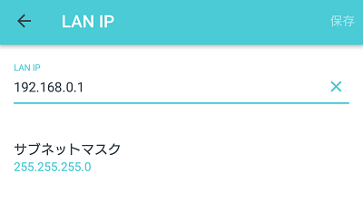

先月、我が家に [TP-Link Deco M5 3台セット](https://amzn.to/3VbWaom) を[導入した](/2018/08/deco-m5/)わけですが、ネットの紹介記事を見ていると次のような課題があるようでした（私はたまたまこれには困っていない）。

* VPN 接続の機能が無い
* WPS ([Wi-Fi Protected Setup](https://ja.wikipedia.org/wiki/Wi-Fi_Protected_Setup)) に対応していない
* LAN 側の IP アドレスを 192.168.0.0/24 から変更できない

なんとこれが、最新の更新ですべて解決されました。

ファームウェアバージョン: 1.2.3 Build 20180819 Rel. 68100 Modifications and Bug Fixes:

1. Added custom configuration options for LAN IP and DHCP server.
2. Added WPS function.
3. Added support for PPTP and L2TP internet connection types.
4. Improved system performance.

### VPN

IPv4 のインターネット接続タイプに「[L2TP](https://ja.wikipedia.org/wiki/Layer_2_Tunneling_Protocol)」、「PPTP」が追加されました 

### WPS

設定メニューに WPS が追加されました

各 Deco の右の丸い WPS アイコンをクリックすると 120 秒のカウントダウンが始まります。この間に端末側の WPS 機能で接続させます。

### LAN IPアドレス、DHCP サーバー設定

詳細設定に「LAN IP」と「DHCPサーバー」メニューが追加されました

「LAN IP」設定で IP アドレスとサブネットマスクを設定できます

「DHCPサーバー」設定でアドレス範囲と DNS サーバーを設定できます。DNS サーバーについては以前も IPv4 設定で指定ができました。ただ、[9.9.9.9](/2017/11/quad9/) を指定していたら [DAZN](https://www.dazn.com/) が提供エリア外と判定されて視聴できなくなって戻した...

今回の更新で導入へのネックが解消されたら導入してみては？ まあ、いろんな意見がありますけどね。

「[もはや、もっといい選択肢はある！　鳴り物入りで日本上陸した「Google Wifi」のメッシュを試す【イニシャルB】 - INTERNET Watch](https://internet.watch.impress.co.jp/docs/column/shimizu/1120372.html)」
