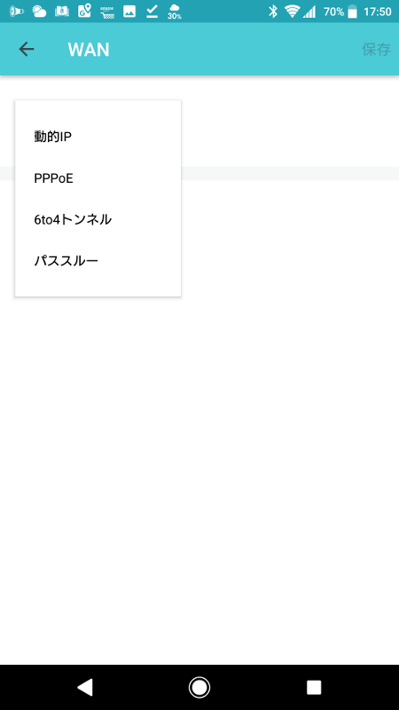
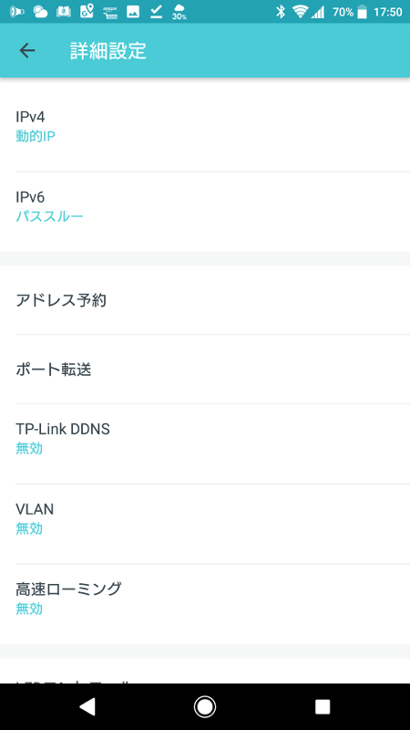

我が家の無線LAN環境改善のために [TP-Link Deco M5 3台セット](https://amzn.to/2vDRBsz)を導入しました。

この記事公開後に新しいファームウエアが出てます「[Deco M5 が VPN、WPS、LANアドレス設定に対応](/2018/09/deco-m5-update-1/)」

### 導入前

これまでの環境は次のようになっており、2つの無線LANアクセスポイントがそれぞれ別の SSID で設置していました。安いのでいいやって適当に2台目を買ったせいでシームレスな移動ができない状況でした。



「無線AP(B)」というやつがブリッジモードにできず、同じ SSID ではうまくハンドオーバーできなかったので別の SSID にして部屋の移動時には手動で切り替えたりしていました。切り替えないで、遠い AP を使い続けると、他の近い端末まで遅くなってしまいます。

### 導入後



Ethernet Backhaul を使うようにしました（これが使えるのもルーターモードだけでした）。でも、部屋の間をつないでいる[マンション備え付けのHUB](https://www2.panasonic.biz/scvb/a2A/opnItemDetail?use_obligation=esctlg&item_cd=WTJ84019&item_no=WTJ84019&catalog_view_flg=1&contents_view_flg=1&close_flg=1&b_cd=301&hinban_kbn=1&s_hinban_key=WTJ84019&vcata_flg=1)が 100Mbps なんですよね... 今どきの無線LAN規格の方が速い。

クローゼット内の[マルチメディアボックス](http://www2.panasonic.biz/es/densetsu/haisen/internet/product/index.html)？に入ってる HUB も 1Gbps 対応のものに交換しようかな。Panasonic のやつは高いな。あまりケチると電源周りが心配になるけど。

### 壁掛け

無線APはできれば高い位置に設置することが望ましいとされています。deco M5 にはサードパーティ製品ですが、壁掛け、天井取付も可能な[ホルダー](https://amzn.to/2nwIdmn)があるので、これを購入して壁にかけました。壁にネジの穴を開けるのはちょっと気になるので[フック](https://amzn.to/2vDJKLT)にかけました。

<iframe sandbox="allow-popups allow-scripts allow-modals allow-forms allow-same-origin" style="width:120px;height:240px;float:left;" marginwidth="0" marginheight="0" scrolling="no" frameborder="0" src="//rcm-fe.amazon-adsystem.com/e/cm?lt1=_blank&bc1=000000&IS2=1&bg1=FFFFFF&fc1=000000&lc1=0000FF&t=ytera-22&language=ja_JP&o=9&p=8&l=as4&m=amazon&f=ifr&ref=as_ss_li_til&asins=B07CGZ8N8Q&linkId=faeea163eace53238fe5839bc25f316d"></iframe> <iframe sandbox="allow-popups allow-scripts allow-modals allow-forms allow-same-origin" style="width:120px;height:240px;float:left;margin-left:20px;" marginwidth="0" marginheight="0" scrolling="no" frameborder="0" src="//rcm-fe.amazon-adsystem.com/e/cm?lt1=_blank&bc1=000000&IS2=1&bg1=FFFFFF&fc1=000000&lc1=0000FF&t=ytera-22&language=ja_JP&o=9&p=8&l=as4&m=amazon&f=ifr&ref=as_ss_li_til&asins=B003CFE5U6&linkId=bd24cc30f32f6807f07c95ad3336a052"></iframe>

### IPv6対応

IPv6 はこれまで通り使えるようにしたいので設定アプリの「詳細設定」から「パススルー」を選択しました。「動的IP」では IPv6 アドレスが配れれなかった。パススルーの場合セキュリティ関連機能はどうなるのかな？

### セキュリティ、ペアレンタルコントロール

端末ごとにグループ分け（アプリの UI 上は誰の端末かを指定する）して、アダルトサイトなどへのアクセス制限をしたり、1日何時間の通信を許可するか、通信を許可する時間帯を制限するかを設定できます。スマホなど、無線LAN以外の通信方法がある場合はそれで通信できちゃうから単にギガの無駄遣いに終わる可能性がありますね...

### Alexa との連携

Alexa スキル [TP-Link ルーター](https://www.amazon.co.jp/TP-Link-%E3%83%AB%E3%83%BC%E3%82%BF%E3%83%BC/dp/B01MS4ODCJ)

* 来客時にゲスト用のWi-Fiを開放する
* WPS機能を使用して、パスワード入力の手間を省いてWi-Fiに端末を接続する
* 夜にルーターのLEDを消す
* インターネット回線の速度を測る
* QoS設定をして特定のデバイスやアクティビティを優先させる

うーん、使う必要なさそう・・・ アレクサっていう名前すら出てこないことがあるのに、コマンドなんて覚えられないよね、天気予報とタイマー以外使ってない・・・

### IFTTT 連携

* [Trigger and Action list of IFTTT that Deco supports?](https://www.tp-link.com/us/faq-1846.html)
* [Do more with TP-Link Router - IFTTT](https://ifttt.com/tplink_router)

これも、今すぐには使う予定はないな

### deco M5 紹介サイト

* [なにこのサクサクつながっていくWi-Fiルーター！TP-Link『Deco M5』が快適すぎる - 週刊アスキー](http://weekly.ascii.jp/elem/000/000/398/398922/)
* [GoogleWiFiと、TP-Link社のDECOの違いを比べてみた！オススメはどっち！？](http://wifiknowledge.com/7413)
* [Google Wifi vs. deco M5　メッシュ対応Wi-Fiルーター徹底比較 (1/6) - ITmedia PC USER](http://www.itmedia.co.jp/pcuser/articles/1806/28/news115.html)
* [Google Wifiより安いTP-LINK Deco m5で問題なし - 就職氷河期 最初の世代、残り20年のための…](https://tak-jp.hatenablog.com/entry/2018/05/02/102822)
* [TP-Link Deco M5 による家庭内メッシュ Wi-Fi 環境 - Qiita](https://qiita.com/ma2shita/items/63f7cbf02bebc66a7a89)
