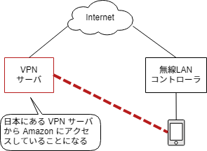
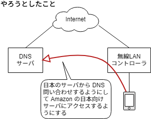
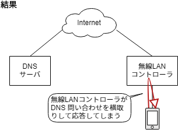
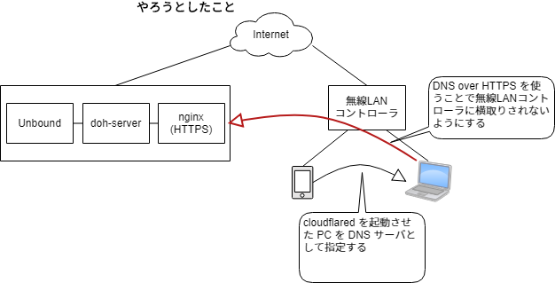
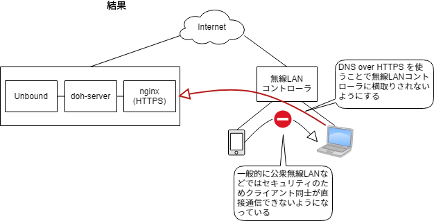

海外滞在中に Amazon Prime Video の日本向けコンテンツを見たかったり、帰りの飛行機の中で見るためにダウンロードしておきたくなったりしますよね。しか～し、普通にアプリを開いても地域制限がかかっているため視聴もダウンロードもできません 😱 残念。

海外で日本向けの動画を見ようとすると次のように表示されて再生できません。



ただ、簡単に諦めてしまうのもつまらないので、なんとかホテルの無線LAN環境からスマホで視聴可能にする方法はないかともがいたログです。

### VPN

まず思いつくのは VPN ですね、日本の IP からのアクセスとなるように日本の VPS とかを使って VPN サーバーをセットアップします。

IDCF クラウドは VPN 環境をさくっと作れるような何かがあった気がするけど個人向けサービスは終了するということなので対象外。安価で、通信量制限もないらしい [ConoHa VPS](https://www.conoha.jp/vps/) を使ってみました。VPN サーバーとして使うだけなので 512MB の月額630円(または1時間1円)で十分です。

Linux Distribution は何でも良いのですが今回は CentOS 7 にした。前は [Ubuntu で構築した](/2016/03/connect-to-private-network-on-digitalocean-using-openvpn/) けど慣れてるし。

[How To Set Up and Configure an OpenVPN Server on CentOS 7](https://www.digitalocean.com/community/tutorials/how-to-set-up-and-configure-an-openvpn-server-on-centos-7) を参考にしたけどまんまではうまくいかなかったのでちょっと調整。（詳細は後で追記するかも）

スマホからの接続には [OpenVPN Connect](https://play.google.com/store/apps/details?id=net.openvpn.openvpn) を使いました。



「よし、これで見れるぞ」と思ったのですが...



[amazon.jp/vpn](https://amazon.jp/vpn)



ぐぬぬ、、撃沈... 😭

### DNS だけ日本のサーバーを使う

VPN 使用時のメッセージから HTTP プロキシは検出されてしまいそうなので次は DNS サーバーだけ日本にあるものをつかうことにします。先ほどの VPN サーバーを DNS サーバーとして使えるように [Unbound](https://www.nlnetlabs.nl/projects/unbound/about/) をセットアップしました。

無線LANで割り当てられたIPアドレスを確認し、固定IPでそれを指定し、DNS サーバーだけ変更しました。



しかし、名前解決ができません。DNS サーバー側でログを見てもクエリが届いてないし、tcpdump をしてみても問い合わせの packet が届きません。ホテルの無線LAN環境は MAC アドレスからするとどうやら [Ruckus Networks](https://www.ruckuswireless.com/) のコントローラが導入されているようです。使い始める際に認証画面が表示されるタイプだったのでおそらく DNS のリクエストはそこでインターセプトされてしまっているようです 😢



またしても撃沈... 😭😭

会社から貸与されているポータブル WiFi ルーターがあるので、これを使って DNS サーバーさえ日本のものが使えれば見れるのか？を確認してみました。仕事と関係ない動画のダウンロードに使うのはよろしくないので動作確認にとどめます。

結果は成功！日本の DNS サーバーさえ使えれば見れることが確認できました。一歩前進。

### DNS over HTTPS を使おう

普通に DNS で問い合わせると無線LANコントローラに横取りされてしまうので、これを避けるために使えるのは DNS over HTTPS じゃないか？ということでこれが可能な Proxy を探してみまたらありました。[cloudflared](https://github.com/cloudflare/cloudflared) でできるようです、これは Go で書かれていてシングルバイナリで Windows 版もあり、[ここ](https://developers.cloudflare.com/argo-tunnel/downloads/)からダウンロードできます。Cloudflare は 1.1.1.1 を提供しているところですね。

[https://developers.cloudflare.com/argo-tunnel/downloads/](https://developers.cloudflare.com/argo-tunnel/downloads/) からバイナリをダウンロードできます。

使い方は次のようになっており、`proxy-dns` コマンドを使えば通常の DNS で受けた問い合わせを DNS over HTTPS で任意の対応サーバーにプロキシしてくれます。

```
$ ./cloudflared --help
NAME:
   cloudflared - Cloudflare's command-line tool and agent

USAGE:
   cloudflared.exe [global options] command [command options] origin-url

VERSION:
   2019.1.0 (built 2019-01-28-2336 UTC)

DESCRIPTION:
   cloudflared connects your machine or user identity to Cloudflare's global network.
  You can use it to authenticate a session to reach an API behind Access, route web traffic to thismachine,
  and configure access control.

COMMANDS:
     update     Update the agent if a new version exists
     version    Print the version
     proxy-dns  Run a DNS over HTTPS proxy server.
     service    Manages the Argo Tunnel Windows service
     help, h    Shows a list of commands or help for one command
   Access (BETA):
     access  access <subcommand>
   Tunnel:
     tunnel  Make a locally-running web service accessible over the internet using Argo Tunnel.

GLOBAL OPTIONS:
   --help, -h         show help (default: false)
   --version, -v, -V  Print the version (default: false)

COPYRIGHT:
   (c) 2019 Cloudflare Inc.
   Use is subject to the license agreement at https://developers.cloudflare.com/argo-tunnel/license/
```

```
$ ./cloudflared proxy-dns --help
NAME:
   cloudflared.exe proxy-dns - Run a DNS over HTTPS proxy server.

USAGE:
   cloudflared.exe proxy-dns [command options]

OPTIONS:
   --metrics value   Listen address for metrics reporting. (default: "localhost:") [%TUNNEL_METRICS%]
   --address value   Listen address for the DNS over HTTPS proxy server. (default: "localhost") [%TUNNEL_DNS_ADDRESS%]
   --port value      Listen on given port for the DNS over HTTPS proxy server. (default: 53) [%TUNNEL_DNS_PORT%]
   --upstream value  Upstream endpoint URL, you can specify multiple endpoints for redundancy. (default: "https://1.1.1.1/dns-query", "https://1.0.0.1/dns-query") [%TUNNEL_DNS_UPSTREAM%]
   --help, -h        show help (default: false)
```

さて、Proxy サーバーは見つかりましたが、[1.1.1.1](https://1.1.1.1/) を使ってしまっては日本からのアクセスにならないはずなので、やはり先ほどの DNS サーバーに今度は DNS over HTTPS サーバーを構築します。[github.com/m13253/dns-over-https](https://github.com/m13253/dns-over-https) が使えるようです。ググれば何でも見つかってすごい。

PC で次のように cloudflared を起動します。

```
$ ./cloudflared proxy-dns --address 0.0.0.0 --upstream https://dns.example.com/dns-query
INFO[0000] Adding DNS upstream                           url="https://dns.example.com/dns-query"
INFO[0000] Starting metrics server                       addr="127.0.0.1:57464"
INFO[0000] Starting DNS over HTTPS proxy server          addr="dns://0.0.0.0:53"
```

この例では DNS サーバーの指定が dns.example.com になっています、Windosw PC 自体もこの proxy サーバーを参照するようにしてしまうと dns.example.com の名前解決ができなくなります...

今回の構成では Windows は DHCP でもらった DNS サーバーをそのまま使用して問題なし。1.1.1.1 は IP アドレスなので名前解決不要なのですが、通常 IP アドレスに対して公的な証明書は取得できないんじゃないかな。

で、次のような構成になりました。cloudflared は証明書のチェックもするので Let's Encrypt で取得しました。



で、結果はというと？



え～っと、、何度目だっけ... 撃沈 😭😭😭  
きっとそうだろうなぁと薄々思いながらやってましたがやっぱり無線の端末同士は通信が許可されていませんでした。まあそうですよね。

### Windows の Mobile Hotspot 機能

あきらめが悪いのでさらに次の手を考えます。PC を無線の親機にできたら解決じゃね？ということです。Windows 10 にはモバイルホットスポット機能というのがあって簡単に無線LANの親機にできちゃいます。

「設定」→「ネットワークとインターネット」で



「モバイルホットスポット」を有効にするだけです



これで完璧！！

のはずでしたが、どうやら会社管理の Windows PC であったため、この通信が許可されないようでした 😵

さすがにここであきらめました。が、帰宅してから家の PC でこの構成が有効であることは確認しました。ヤッタネ 😉

（ただ、映画館で予告編とか見てるとこれも見たいあれも見たいってなるけどいざ Prime Video でどれ見ようかなって探すときには見たいものが全然無いんだよなあ）

帰りの飛行機は行きよりも映画のラインナップがずっと良くて助かりました。
