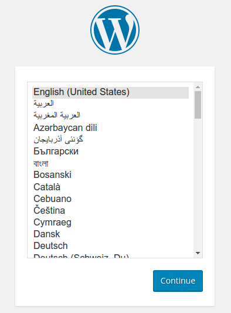

そろそろ 1.12 の正式版がリリースされる予定ですが [DigitalOcean](https://m.do.co/c/97e74a2e7336) に Ubuntu 14.04 を4台用意して Docker 1.12-rc5 をインストールします。

```
root@sm01:~# curl -fsSL https://test.docker.com/ | sh
```

```
root@sm01:~# docker version
Client:
 Version:      1.12.0-rc5
 API version:  1.24
 Go version:   go1.6.3
 Git commit:   a3f2063
 Built:        Tue Jul 26 13:32:56 2016
 OS/Arch:      linux/amd64

Server:
 Version:      1.12.0-rc5
 API version:  1.24
 Go version:   go1.6.3
 Git commit:   a3f2063
 Built:        Tue Jul 26 13:32:56 2016
 OS/Arch:      linux/amd64
root@sm01:~#
```

```
root@sm01:~# docker info
Containers: 0
 Running: 0
 Paused: 0
 Stopped: 0
Images: 0
Server Version: 1.12.0-rc5
Storage Driver: aufs
 Root Dir: /var/lib/docker/aufs
 Backing Filesystem: extfs
 Dirs: 0
 Dirperm1 Supported: true
Logging Driver: json-file
Cgroup Driver: cgroupfs
Plugins:
 Volume: local
 Network: null host bridge overlay
Swarm: inactive
Runtimes: runc
Default Runtime: runc
Security Options: apparmor
Kernel Version: 4.4.0-31-generic
Operating System: Ubuntu 14.04.4 LTS
OSType: linux
Architecture: x86\_64
CPUs: 2
Total Memory: 1.954 GiB
Name: sm01
ID: MGAP:D3I3:LLZT:4RRL:WVUI:HR6U:6XJ3:ON3D:OERN:RBRR:7H6A:I3YG
Docker Root Dir: /var/lib/docker
Debug Mode (client): false
Debug Mode (server): false
Registry: https://index.docker.io/v1/
WARNING: No swap limit support
Insecure Registries:
 127.0.0.0/8
root@sm01:~#
```

1.12 といえば Swarm mode なので早速

```
root@sm01:~# docker swarm init --help

Usage:  docker swarm init [OPTIONS]

Initialize a swarm

Options:
      --advertise-addr string           Advertised address (format: <ip|interface>[:port])
      --cert-expiry duration            Validity period for node certificates (default 2160h0m0s)
      --dispatcher-heartbeat duration   Dispatcher heartbeat period (default 5s)
      --external-ca value               Specifications of one or more certificate signing endpoints
      --force-new-cluster               Force create a new cluster from current state.
      --help                            Print usage
      --listen-addr value               Listen address (format: <ip|interface>[:port]) (default 0.0.0.0:2377)
      --task-history-limit int          Task history retention limit (default 5)
root@sm01:~#
```

4台の Private address は次の通り

```
sm01 eth1 10.130.9.198
sm02 eth1 10.130.14.153
sm03 eth1 10.130.21.166
sm04 eth1 10.130.42.39
```

```
root@sm01:~# docker swarm init --listen-addr eth1 --advertise-addr eth1
Swarm initialized: current node (8y26xoif1ucu2dr4lnet0z4rk) is now a manager.

To add a worker to this swarm, run the following command:
    docker swarm join \
    --token SWMTKN-1-4lz4k3n65d76akrxn934md0e0zrgq5bsq5jf2gq54icncq37qp-009402j3gts3zm1vvqrkqp79f \
    10.130.9.198:2377

To add a manager to this swarm, run the following command:
    docker swarm join \
    --token SWMTKN-1-4lz4k3n65d76akrxn934md0e0zrgq5bsq5jf2gq54icncq37qp-2nxm00jx3vehtromd3xdgalgg \
    10.130.9.198:2377
root@sm01:~#
```

`worker` として join するか `manager` として join するかは `--token` の値によって決まるようです。rc4 までにあった `--manager` というオプションはなくなっています。`--auto-accept` もなくなりました。 init 時の `--advertise-addr` も必須になりました。これを明示しなくてハマる人が多かったようです。`--task-history-limit` は説明「Task history retention limit (default 5)」を読んでも謎ですね。これは Docker イメージの更新などで入れかわた container の履歴とそのボリューム(?)を何世代残すかという設定になります。これを超えてはじめて docker rm されることになります。 それでは manager x3 + worker x1 の構成にしてみます。

```
root@sm02:~# docker swarm join --listen-addr eth1 --advertise-addr eth1 \
  --token SWMTKN-1-4lz4k3n65d76akrxn934md0e0zrgq5bsq5jf2gq54icncq37qp-2nxm00jx3vehtromd3xdgalgg \
  10.130.9.198:2377
This node joined a swarm as a manager.
root@sm02:~#
```

sm03 は sm02 と同じなので省略

```
root@sm04:~# docker swarm join --listen-addr eth1 --advertise-addr eth1 \
  --token SWMTKN-1-4lz4k3n65d76akrxn934md0e0zrgq5bsq5jf2gq54icncq37qp-009402j3gts3zm1vvqrkqp79f \
  10.130.9.198:2377
This node joined a swarm as a worker.
root@sm04:~#
```

```
root@sm01:~# docker node ls
ID                           HOSTNAME  STATUS  AVAILABILITY  **MANAGER STATUS**
3v11smnwwulxd987mtix494so    sm02      Ready   Active        **Reachable**
4mg10n4rirjylaaekiekybcnl    sm03      Ready   Active        **Reachable**
4p396pp5d3qe3e8sns6er3bgx    sm04      Ready   Active
8y26xoif1ucu2dr4lnet0z4rk *  sm01      Ready   Active        **Leader**
root@sm01:~#
```

join される側での accept 処理は不要になってます。もう完成してしまいました。 token を忘れたり、漏洩しちゃったらどうしましょう？ 忘れた場合は `docker swarm join-token {manager|worker}` で確認できます。

```
root@sm01:~# docker swarm join-token worker
To add a worker to this swarm, run the following command:
    docker swarm join \
    --token SWMTKN-1-4lz4k3n65d76akrxn934md0e0zrgq5bsq5jf2gq54icncq37qp-009402j3gts3zm1vvqrkqp79f \
    10.130.9.198:2377
root@sm01:~# docker swarm join-token manager
To add a manager to this swarm, run the following command:
    docker swarm join \
    --token SWMTKN-1-4lz4k3n65d76akrxn934md0e0zrgq5bsq5jf2gq54icncq37qp-2nxm00jx3vehtromd3xdgalgg \
    10.130.9.198:2377
root@sm01:~# 
```

漏洩しちゃったり、しばらく使わないという場合は rotate させます。

```
root@sm01:~# docker swarm join-token --rotate worker
To add a worker to this swarm, run the following command:
    docker swarm join \
    --token SWMTKN-1-4lz4k3n65d76akrxn934md0e0zrgq5bsq5jf2gq54icncq37qp-4igl65pp3mbgt29t8wy1visjk \
    10.130.9.198:2377
root@sm01:~# docker swarm join-token --rotate manager
To add a manager to this swarm, run the following command:
    docker swarm join \
    --token SWMTKN-1-4lz4k3n65d76akrxn934md0e0zrgq5bsq5jf2gq54icncq37qp-bbb6n7i318f6npco5wd5mg43y \
    10.130.9.198:2377
root@sm01:~#
```

これで新しい token が発行され、古いものは無効になりました。join のためのコマンドまで表示されてちょっとうざいっていう場合は `-q` を追加します。

```
root@sm01:~# docker swarm join-token -q worker
SWMTKN-1-4lz4k3n65d76akrxn934md0e0zrgq5bsq5jf2gq54icncq37qp-4igl65pp3mbgt29t8wy1visjk
root@sm01:~# docker swarm join-token -q manager
SWMTKN-1-4lz4k3n65d76akrxn934md0e0zrgq5bsq5jf2gq54icncq37qp-bbb6n7i318f6npco5wd5mg43y
root@sm01:~# 
```

```
root@sm01:~# docker info
Containers: 0
 Running: 0
 Paused: 0
 Stopped: 0
Images: 0
Server Version: 1.12.0-rc5
Storage Driver: aufs
 Root Dir: /var/lib/docker/aufs
 Backing Filesystem: extfs
 Dirs: 0
 Dirperm1 Supported: true
Logging Driver: json-file
Cgroup Driver: cgroupfs
Plugins:
 Volume: local
 Network: bridge null host overlay
Swarm: active
 NodeID: 8y26xoif1ucu2dr4lnet0z4rk
 Is Manager: true
 Managers: 3
 Nodes: 4
 Node Address: 10.130.9.198
Runtimes: runc
Default Runtime: runc
Security Options: apparmor
Kernel Version: 4.4.0-31-generic
Operating System: Ubuntu 14.04.4 LTS
OSType: linux
Architecture: x86_64
CPUs: 2
Total Memory: 1.954 GiB
Name: sm01
ID: MGAP:D3I3:LLZT:4RRL:WVUI:HR6U:6XJ3:ON3D:OERN:RBRR:7H6A:I3YG
Docker Root Dir: /var/lib/docker
Debug Mode (client): false
Debug Mode (server): false
Registry: https://index.docker.io/v1/
WARNING: No swap limit support
Insecure Registries:
 127.0.0.0/8
root@sm01:~#
```

```
Swarm: active
 NodeID: 8y26xoif1ucu2dr4lnet0z4rk
 Is Manager: true
 Managers: 3
 Nodes: 4
 Node Address: 10.130.9.198
```

docker-compose のインストール

```
root@sm01:~# curl -Lo /usr/bin/docker-compose https://github.com/docker/compose/releases/download/1.8.0/docker-compose-`uname -s`-`uname -m`
  % Total    % Received % Xferd  Average Speed   Time    Time     Time  Current
                                 Dload  Upload   Total   Spent    Left  Speed
100   600    0   600    0     0    509      0 --:--:--  0:00:01 --:--:--   509
100 7783k  100 7783k    0     0   925k      0  0:00:08  0:00:08 --:--:-- 1660k
root@sm01:~# chmod 755 /usr/bin/docker-compose 
root@sm01:~# 
```

[https://docs.docker.com/compose/wordpress/](https://docs.docker.com/compose/wordpress/) にある wordpress を実行するための docker-compose.yml を使ってコンテナを実行してみます

```
root@sm01:~/wordpress# vi docker-compose.yml
root@sm01:~/wordpress# docker-compose up -d
WARNING: The Docker Engine you're using is running in swarm mode.

Compose does not use swarm mode to deploy services to multiple nodes in a swarm. All containers will be scheduled on the current node.

To deploy your application across the swarm, use the bundle feature of the Docker experimental build.

More info:
https://docs.docker.com/compose/bundles

Creating network "wordpress_default" with the default driver
Pulling db (mysql:5.7)...
5.7: Pulling from library/mysql
5c90d4a2d1a8: Pull complete
...
b836883cb3d9: Pull complete
Digest: sha256:a9a5b559f8821fe73d58c3606c812d1c044868d42c63817fa5125fd9d8b7b539
Status: Downloaded newer image for mysql:5.7
Pulling wordpress (wordpress:latest)...
latest: Pulling from library/wordpress
5c90d4a2d1a8: Already exists
9e955ea56615: Pull complete
...
417100314774: Pull complete
Digest: sha256:0f73fa5e20b0194c6cffc78143e9b9b966c952b57118be12526edb058726cd92
Status: Downloaded newer image for wordpress:latest
Creating wordpress_db_1
Creating wordpress_wordpress_1
root@sm01:~/wordpress# docker-compose ps
        Name                       Command               State          Ports         
-------------------------------------------------------------------------------------
wordpress_db_1          docker-entrypoint.sh mysqld      Up      3306/tcp             
wordpress_wordpress_1   /entrypoint.sh apache2-for ...   Up      0.0.0.0:8000->80/tcp 
root@sm01:~/wordpress# 
```

docker ホストの 8000 番ポートにアクセスすると wordpress が起動しています。



ですが、次のような WARNING が出ています

**WARNING**: The Docker Engine you're using is running in swarm mode. Compose does not use swarm mode to deploy services to multiple nodes in a swarm. All containers will be scheduled on the current node. To deploy your application across the swarm, use the bundle feature of the Docker experimental build. More info: [https://docs.docker.com/compose/bundles](https://docs.docker.com/compose/bundles)

1.11 の Swarm では docker-compose でも node をまたがって container が展開されていましたが、それをやりたかたら bundle を使えってことのようです。でも bundle ってまだ仕様も固まってないんじゃなかったかな？ 今回の docker-compose.yml には

```yaml
    volumes:
      - "./.data/db:/var/lib/mysql"
```

てな定義もあるからどっちにしてもダメか.. ちょっと dockercon 2016 にあわせていろいろ詰め込み過ぎたんじゃないかと思うわけですが、Docker の release policy は次のようになっているので... [https://github.com/docker/docker/wiki](https://github.com/docker/docker/wiki)

> The Docker follows a time-based release process, currently aiming at releasing a new major version every two months. We issue a code freeze several weeks before the scheduled release date during which nothing but bugfixes can be added to the release. Even though the process is time-based, the Docker Engine sets short-term goals for the upcoming release(s). However, time will always win over features: the code freeze will happen regardless of our goals being met.

Service について

```
root@sm01:~/wordpress# docker service create --name nginx --replicas 5 nginx
e28bh091n39zxvav6f3agmf1v
```

これだけで nginx container を 5 つキープしてくれる が、`docker run` に比べて圧倒的に起動時のオプションが少ない

```
root@sm01:~/wordpress# docker service create --help

Usage:	docker service create [OPTIONS] IMAGE [COMMAND] [ARG...]

Create a new service

Options:
      --constraint value               Placement constraints (default [])
      --container-label value          Container labels (default [])
      --endpoint-mode string           Endpoint mode (vip or dnsrr)
  -e, --env value                      Set environment variables (default [])
      --help                           Print usage
  -l, --label value                    Service labels (default [])
      --limit-cpu value                Limit CPUs (default 0.000)
      --limit-memory value             Limit Memory (default 0 B)
      --log-driver string              Logging driver for service
      --log-opt value                  Logging driver options (default [])
      --mode string                    Service mode (replicated or global) (default "replicated")
      --mount value                    Attach a mount to the service
      --name string                    Service name
      --network value                  Network attachments (default [])
  -p, --publish value                  Publish a port as a node port (default [])
      --replicas value                 Number of tasks (default none)
      --reserve-cpu value              Reserve CPUs (default 0.000)
      --reserve-memory value           Reserve Memory (default 0 B)
      --restart-condition string       Restart when condition is met (none, on-failure, or any)
      --restart-delay value            Delay between restart attempts (default none)
      --restart-max-attempts value     Maximum number of restarts before giving up (default none)
      --restart-window value           Window used to evaluate the restart policy (default none)
      --stop-grace-period value        Time to wait before force killing a container (default none)
      --update-delay duration          Delay between updates
      --update-failure-action string   Action on update failure (pause|continue) (default "pause")
      --update-parallelism uint        Maximum number of tasks updated simultaneously (0 to update all at once) (default 1)
  -u, --user string                    Username or UID
      --with-registry-auth             Send registry authentication details to swarm agents
  -w, --workdir string                 Working directory inside the container
```

```
root@sm01:~/wordpress# docker service inspect e2
[
    {
        "ID": "e28bh091n39zxvav6f3agmf1v",
        "Version": {
            "Index": 45
        },
        "CreatedAt": "2016-07-28T16:17:29.6671509Z",
        "UpdatedAt": "2016-07-28T16:17:29.6671509Z",
        "Spec": {
            "Name": "nginx",
            "TaskTemplate": {
                "ContainerSpec": {
                    "Image": "nginx"
                },
                "Resources": {
                    "Limits": {},
                    "Reservations": {}
                },
                "RestartPolicy": {
                    "Condition": "any",
                    "MaxAttempts": 0
                },
                "Placement": {}
            },
            "Mode": {
                "Replicated": {
                    "Replicas": 5
                }
            },
            "UpdateConfig": {
                "Parallelism": 1,
                "FailureAction": "pause"
            },
            "EndpointSpec": {
                "Mode": "vip"
            }
        },
        "Endpoint": {
            "Spec": {}
        },
        "UpdateStatus": {
            "StartedAt": "0001-01-01T00:00:00Z",
            "CompletedAt": "0001-01-01T00:00:00Z"
        }
    }
]
root@sm01:~/wordpress# 
```

```
root@sm01:~/wordpress# docker ps
CONTAINER ID        IMAGE               COMMAND                  CREATED             STATUS              PORTS                  NAMES
3063f0490040        nginx:latest        "nginx -g 'daemon off"   2 minutes ago       Up 2 minutes        80/tcp, 443/tcp        nginx.1.4hxwvcyyk4wficzyqi3bmrxt3
fde5a780144e        wordpress:latest    "/entrypoint.sh apach"   2 hours ago         Up 2 hours          0.0.0.0:8000->80/tcp   wordpress_wordpress_1
359e31c3465a        mysql:5.7           "docker-entrypoint.sh"   2 hours ago         Up 2 hours          3306/tcp               wordpress_db_1
root@sm01:~/wordpress# docker inspect 30
[
    {
        "Id": "3063f04900407965e5d2a509fd24b15b54b7c1a1ed89712817507cdd3975e934",
        "Created": "2016-07-28T16:17:51.378771708Z",
        "Path": "nginx",
        "Args": [
            "-g",
            "daemon off;"
        ],
        "State": {
            "Status": "running",
            "Running": true,
            "Paused": false,
            "Restarting": false,
            "OOMKilled": false,
            "Dead": false,
            "Pid": 6060,
            "ExitCode": 0,
            "Error": "",
            "StartedAt": "2016-07-28T16:17:51.714182965Z",
            "FinishedAt": "0001-01-01T00:00:00Z"
        },
        "Image": "sha256:0d409d33b27e47423b049f7f863faa08655a8c901749c2b25b93ca67d01a470d",
        "ResolvConfPath": "/var/lib/docker/containers/3063f04900407965e5d2a509fd24b15b54b7c1a1ed89712817507cdd3975e934/resolv.conf",
        "HostnamePath": "/var/lib/docker/containers/3063f04900407965e5d2a509fd24b15b54b7c1a1ed89712817507cdd3975e934/hostname",
        "HostsPath": "/var/lib/docker/containers/3063f04900407965e5d2a509fd24b15b54b7c1a1ed89712817507cdd3975e934/hosts",
        "LogPath": "/var/lib/docker/containers/3063f04900407965e5d2a509fd24b15b54b7c1a1ed89712817507cdd3975e934/3063f04900407965e5d2a509fd24b15b54b7c1a1ed89712817507cdd3975e934-json.log",
        "Name": "/nginx.1.4hxwvcyyk4wficzyqi3bmrxt3",
        "RestartCount": 0,
        "Driver": "aufs",
        "MountLabel": "",
        "ProcessLabel": "",
        "AppArmorProfile": "",
        "ExecIDs": null,
        "HostConfig": {
            "Binds": null,
            "ContainerIDFile": "",
            "LogConfig": {
                "Type": "json-file",
                "Config": {}
            },
            "NetworkMode": "default",
            "PortBindings": null,
            "RestartPolicy": {
                "Name": "",
                "MaximumRetryCount": 0
            },
            "AutoRemove": false,
            "VolumeDriver": "",
            "VolumesFrom": null,
            "CapAdd": null,
            "CapDrop": null,
            "Dns": null,
            "DnsOptions": null,
            "DnsSearch": null,
            "ExtraHosts": null,
            "GroupAdd": null,
            "IpcMode": "",
            "Cgroup": "",
            "Links": null,
            "OomScoreAdj": 0,
            "PidMode": "",
            "Privileged": false,
            "PublishAllPorts": false,
            "ReadonlyRootfs": false,
            "SecurityOpt": null,
            "UTSMode": "",
            "UsernsMode": "",
            "ShmSize": 67108864,
            "Runtime": "runc",
            "ConsoleSize": [
                0,
                0
            ],
            "Isolation": "",
            "CpuShares": 0,
            "Memory": 0,
            "CgroupParent": "",
            "BlkioWeight": 0,
            "BlkioWeightDevice": null,
            "BlkioDeviceReadBps": null,
            "BlkioDeviceWriteBps": null,
            "BlkioDeviceReadIOps": null,
            "BlkioDeviceWriteIOps": null,
            "CpuPeriod": 0,
            "CpuQuota": 0,
            "CpusetCpus": "",
            "CpusetMems": "",
            "Devices": null,
            "DiskQuota": 0,
            "KernelMemory": 0,
            "MemoryReservation": 0,
            "MemorySwap": 0,
            "MemorySwappiness": -1,
            "OomKillDisable": false,
            "PidsLimit": 0,
            "Ulimits": null,
            "CpuCount": 0,
            "CpuPercent": 0,
            "IOMaximumIOps": 0,
            "IOMaximumBandwidth": 0
        },
        "GraphDriver": {
            "Name": "aufs",
            "Data": null
        },
        "Mounts": [],
        "Config": {
            "Hostname": "3063f0490040",
            "Domainname": "",
            "User": "",
            "AttachStdin": false,
            "AttachStdout": false,
            "AttachStderr": false,
            "ExposedPorts": {
                "443/tcp": {},
                "80/tcp": {}
            },
            "Tty": false,
            "OpenStdin": false,
            "StdinOnce": false,
            "Env": [
                "PATH=/usr/local/sbin:/usr/local/bin:/usr/sbin:/usr/bin:/sbin:/bin",
                "NGINX_VERSION=1.11.1-1~jessie"
            ],
            "Cmd": [
                "nginx",
                "-g",
                "daemon off;"
            ],
            "Image": "nginx:latest",
            "Volumes": null,
            "WorkingDir": "",
            "Entrypoint": null,
            "OnBuild": null,
            "Labels": {
                "com.docker.swarm.node.id": "8y26xoif1ucu2dr4lnet0z4rk",
                "com.docker.swarm.service.id": "e28bh091n39zxvav6f3agmf1v",
                "com.docker.swarm.service.name": "nginx",
                "com.docker.swarm.task": "",
                "com.docker.swarm.task.id": "4hxwvcyyk4wficzyqi3bmrxt3",
                "com.docker.swarm.task.name": "nginx.1"
            }
        },
        "NetworkSettings": {
            "Bridge": "",
            "SandboxID": "e9163754dadff812153de58d8e2594ee41f2933baf2036e7d070020216c12dd0",
            "HairpinMode": false,
            "LinkLocalIPv6Address": "",
            "LinkLocalIPv6PrefixLen": 0,
            "Ports": {
                "443/tcp": null,
                "80/tcp": null
            },
            "SandboxKey": "/var/run/docker/netns/e9163754dadf",
            "SecondaryIPAddresses": null,
            "SecondaryIPv6Addresses": null,
            "EndpointID": "500d153bda733300fd88145230a8bb0f50c83b494d1d4ea8fbf3cd6f96c26d54",
            "Gateway": "172.17.0.1",
            "GlobalIPv6Address": "",
            "GlobalIPv6PrefixLen": 0,
            "IPAddress": "172.17.0.2",
            "IPPrefixLen": 16,
            "IPv6Gateway": "",
            "MacAddress": "02:42:ac:11:00:02",
            "Networks": {
                "bridge": {
                    "IPAMConfig": null,
                    "Links": null,
                    "Aliases": null,
                    "NetworkID": "aa10bf2517626132866dbf519bbd99163e65ed449e7ada028e1b723ee33f4b46",
                    "EndpointID": "500d153bda733300fd88145230a8bb0f50c83b494d1d4ea8fbf3cd6f96c26d54",
                    "Gateway": "172.17.0.1",
                    "IPAddress": "172.17.0.2",
                    "IPPrefixLen": 16,
                    "IPv6Gateway": "",
                    "GlobalIPv6Address": "",
                    "GlobalIPv6PrefixLen": 0,
                    "MacAddress": "02:42:ac:11:00:02"
                }
            }
        }
    }
]
root@sm01:~/wordpress# 
```

この状態から nginx.3 を `docker kill` で止めてみる

```
root@sm01:~/wordpress# docker service tasks nginx
ID                         NAME     IMAGE  NODE  DESIRED STATE  CURRENT STATE          ERROR
4hxwvcyyk4wficzyqi3bmrxt3  nginx.1  nginx  sm01  Running        Running 4 minutes ago  
dgv49gkq3dlwm620vpz03f0c5  nginx.2  nginx  sm03  Running        Running 4 minutes ago  
boscs727ouw0859osiiko5j3f  nginx.3  nginx  sm02  Running        Running 4 minutes ago  
80e990f922jaohfalmtg20pjc  nginx.4  nginx  sm04  Running        Running 4 minutes ago  
6tjgw5kqdoglzbk2ckgffr4dk  nginx.5  nginx  sm04  Running        Running 4 minutes ago  
```

```
root@sm02:~# docker ps
CONTAINER ID        IMAGE               COMMAND                  CREATED             STATUS              PORTS               NAMES
7bbace95d718        nginx:latest        "nginx -g 'daemon off"   4 minutes ago       Up 4 minutes        80/tcp, 443/tcp     nginx.3.boscs727ouw0859osiiko5j3f
root@sm02:~# docker kill 7b
7b
root@sm02:~# 
```

restart してくれた。 `_nginx.3` となっているのが swram init のところででてきた history というやつですね、デフォルトではこれが 5 つまでずらずらと残ります。

```
root@sm01:~/wordpress# docker service tasks nginx
ID                         NAME         IMAGE  NODE  DESIRED STATE  CURRENT STATE            ERROR
4hxwvcyyk4wficzyqi3bmrxt3  nginx.1      nginx  sm01  Running        Running 5 minutes ago    
dgv49gkq3dlwm620vpz03f0c5  nginx.2      nginx  sm03  Running        Running 5 minutes ago    
dd4tvbrsqc7zqelzqak4tar9c  nginx.3      nginx  sm02  Ready          Preparing 2 seconds ago  
boscs727ouw0859osiiko5j3f   \_ nginx.3  nginx  sm02  Shutdown       Failed 2 seconds ago     "task: non-zero exit (137)"
80e990f922jaohfalmtg20pjc  nginx.4      nginx  sm04  Running        Running 5 minutes ago    
6tjgw5kqdoglzbk2ckgffr4dk  nginx.5      nginx  sm04  Running        Running 5 minutes ago    
root@sm01:~/wordpress# docker service tasks nginx
ID                         NAME         IMAGE  NODE  DESIRED STATE  CURRENT STATE          ERROR
4hxwvcyyk4wficzyqi3bmrxt3  nginx.1      nginx  sm01  Running        Running 5 minutes ago  
dgv49gkq3dlwm620vpz03f0c5  nginx.2      nginx  sm03  Running        Running 5 minutes ago  
dd4tvbrsqc7zqelzqak4tar9c  nginx.3      nginx  sm02  Running        Running 7 seconds ago  
boscs727ouw0859osiiko5j3f   \_ nginx.3  nginx  sm02  Shutdown       Failed 13 seconds ago  "task: non-zero exit (137)"
80e990f922jaohfalmtg20pjc  nginx.4      nginx  sm04  Running        Running 5 minutes ago  
6tjgw5kqdoglzbk2ckgffr4dk  nginx.5      nginx  sm04  Running        Running 5 minutes ago  
```

Leader node (sm01) を停止させてみる (SIGKILL)

```
root@sm02:~# docker node ls
ID                           HOSTNAME  STATUS  AVAILABILITY  MANAGER STATUS
3v11smnwwulxd987mtix494so *  sm02      Ready   Active        Reachable
4mg10n4rirjylaaekiekybcnl    sm03      Ready   Active        Reachable
4p396pp5d3qe3e8sns6er3bgx    sm04      Ready   Active        
8y26xoif1ucu2dr4lnet0z4rk    sm01      Ready   Active        Leader
root@sm02:~# docker node ls
ID                           HOSTNAME  STATUS   AVAILABILITY  MANAGER STATUS
3v11smnwwulxd987mtix494so *  sm02      Unknown  Active        Leader
4mg10n4rirjylaaekiekybcnl    sm03      Unknown  Active        Reachable
4p396pp5d3qe3e8sns6er3bgx    sm04      Unknown  Active        
8y26xoif1ucu2dr4lnet0z4rk    sm01      Unknown  Active        Unreachable
```

sm02 が Leader に昇格しました。Service, Task についても sm01 で実行されていた task が sm03 で起動されました。

```
root@sm02:~# docker service tasks nginx
ID                         NAME         IMAGE  NODE  DESIRED STATE  CURRENT STATE           ERROR
4hxwvcyyk4wficzyqi3bmrxt3  nginx.1      nginx  sm01  Running        Running 15 minutes ago  
dgv49gkq3dlwm620vpz03f0c5  nginx.2      nginx  sm03  Running        Running 15 minutes ago  
dd4tvbrsqc7zqelzqak4tar9c  nginx.3      nginx  sm02  Running        Running 9 minutes ago   
boscs727ouw0859osiiko5j3f   \_ nginx.3  nginx  sm02  Shutdown       Failed 10 minutes ago   "task: non-zero exit (137)"
80e990f922jaohfalmtg20pjc  nginx.4      nginx  sm04  Running        Running 15 minutes ago  
6tjgw5kqdoglzbk2ckgffr4dk  nginx.5      nginx  sm04  Running        Running 15 minutes ago  
root@sm02:~# docker service tasks nginx
ID                         NAME         IMAGE  NODE  DESIRED STATE  CURRENT STATE            ERROR
22qjm1w4a0wkj2bkkbj7arji0  nginx.1      nginx  sm03  Running        Running 57 seconds ago   
4hxwvcyyk4wficzyqi3bmrxt3   \_ nginx.1  nginx  sm01  Shutdown       Complete 21 seconds ago  
dgv49gkq3dlwm620vpz03f0c5  nginx.2      nginx  sm03  Running        Running 16 minutes ago   
dd4tvbrsqc7zqelzqak4tar9c  nginx.3      nginx  sm02  Running        Running 11 minutes ago   
boscs727ouw0859osiiko5j3f   \_ nginx.3  nginx  sm02  Shutdown       Failed 11 minutes ago    "task: non-zero exit (137)"
80e990f922jaohfalmtg20pjc  nginx.4      nginx  sm04  Running        Running 16 minutes ago   
6tjgw5kqdoglzbk2ckgffr4dk  nginx.5      nginx  sm04  Running        Running 16 minutes ago   
```

sm01 を再起動させたら何事もなかったかのようにクラスタに参加してきました

```
root@sm02:~# docker node ls
ID                           HOSTNAME  STATUS  AVAILABILITY  MANAGER STATUS
3v11smnwwulxd987mtix494so *  sm02      Ready   Active        Leader
4mg10n4rirjylaaekiekybcnl    sm03      Ready   Active        Reachable
4p396pp5d3qe3e8sns6er3bgx    sm04      Ready   Active        
8y26xoif1ucu2dr4lnet0z4rk    sm01      Ready   Active        Reachable
```

けれども勝手にリバランスされりはしないので nginx.4, nginx.5 の2つが稼働しえいる sm04 で nginx.5 を kill してみる

```
root@sm02:~# docker service tasks nginx
ID                         NAME         IMAGE  NODE  DESIRED STATE  CURRENT STATE                ERROR
22qjm1w4a0wkj2bkkbj7arji0  nginx.1      nginx  sm03  Running        Running 11 minutes ago       
4hxwvcyyk4wficzyqi3bmrxt3   \_ nginx.1  nginx  sm01  Shutdown       Complete about a minute ago  
dgv49gkq3dlwm620vpz03f0c5  nginx.2      nginx  sm03  Running        Running 26 minutes ago       
dd4tvbrsqc7zqelzqak4tar9c  nginx.3      nginx  sm02  Running        Running 21 minutes ago       
boscs727ouw0859osiiko5j3f   \_ nginx.3  nginx  sm02  Shutdown       Failed 21 minutes ago        "task: non-zero exit (137)"
80e990f922jaohfalmtg20pjc  nginx.4      nginx  sm04  Running        Running 26 minutes ago       
6tjgw5kqdoglzbk2ckgffr4dk  nginx.5      nginx  sm04  Running        Running 26 minutes ago       
```

sm01 に配置されました

```
root@sm01:~# docker service tasks nginx
ID                         NAME         IMAGE  NODE  DESIRED STATE  CURRENT STATE           ERROR
22qjm1w4a0wkj2bkkbj7arji0  nginx.1      nginx  sm03  Running        Running 13 minutes ago  
4hxwvcyyk4wficzyqi3bmrxt3   \_ nginx.1  nginx  sm01  Shutdown       Complete 3 minutes ago  
dgv49gkq3dlwm620vpz03f0c5  nginx.2      nginx  sm03  Running        Running 28 minutes ago  
dd4tvbrsqc7zqelzqak4tar9c  nginx.3      nginx  sm02  Running        Running 23 minutes ago  
boscs727ouw0859osiiko5j3f   \_ nginx.3  nginx  sm02  Shutdown       Failed 23 minutes ago   "task: non-zero exit (137)"
80e990f922jaohfalmtg20pjc  nginx.4      nginx  sm04  Running        Running 28 minutes ago  
6p152l80j7kdlbhhitowbzn1a  nginx.5      nginx  sm01  Running        Running 12 seconds ago  
6tjgw5kqdoglzbk2ckgffr4dk   \_ nginx.5  nginx  sm04  Shutdown       Failed 17 seconds ago   "task: non-zero exit (137)"
```

簡単なテストは期待通りに動作したようです。 bundle について調査しなくっちゃ。
