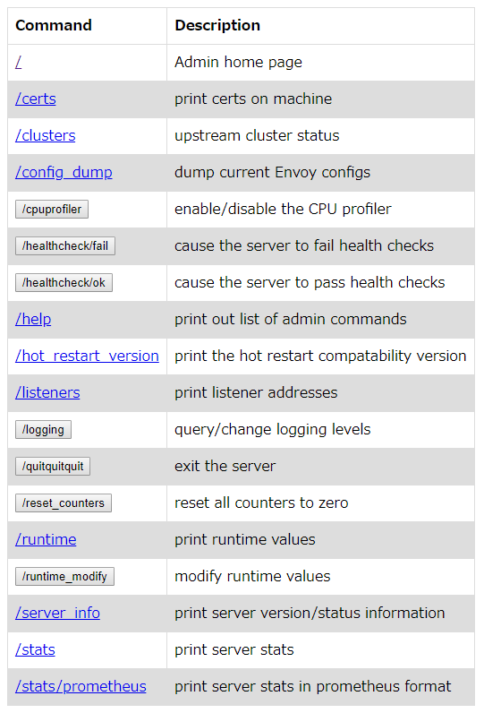

Envoy Proxy が気になっていて、docker-compose で手軽に試せる Sandbox というものがあったので試してみます

[Docs » Getting Started » Sandboxes » Front Proxy](https://www.envoyproxy.io/docs/envoy/latest/start/sandboxes/front_proxy)

[https://github.com/envoyproxy/envoy/tree/master/examples/front-proxy](https://github.com/envoyproxy/envoy/tree/master/examples/front-proxy) を使います 次のような構成を docker-compose で作ります


```
$ git clone https://github.com/envoyproxy/envoy.git
$ cd examples/front-proxy
$ docker-compose up --build -d
$ docker-compose ps
          Name                        Command               State                            Ports  
---------------------------------------------------------------------------------------------------------------------------
frontproxy_front-envoy_1   /usr/bin/dumb-init -- /bin ...   Up      10000/tcp, 0.0.0.0:8000->80/tcp, 0.0.0.0:8001->8001/tcp
frontproxy_service1_1      /bin/sh -c /usr/local/bin/ ...   Up      10000/tcp, 80/tcp               
frontproxy_service2_1      /bin/sh -c /usr/local/bin/ ...   Up      10000/tcp, 80/tcp
```

curl で `/service/1` にアクセスすると service1 コンテナに proxy されます。また、`/service/2` は service2 に proxy されます。

```
$ curl -sv $(docker-machine ip default):8000/service/1
Hello from behind Envoy (service 1)! hostname: e145f697d053 resolvedhostname: 172.18.0.3
*   Trying 192.168.99.100...
* TCP_NODELAY set
* Connected to 192.168.99.100 (192.168.99.100) port 8000 (#0)
> GET /service/1 HTTP/1.1
> Host: 192.168.99.100:8000
> User-Agent: curl/7.57.0
> Accept: */*
>
< HTTP/1.1 200 OK
< content-type: text/html; charset=utf-8
< content-length: 89
< server: envoy
< date: Tue, 10 Apr 2018 12:58:39 GMT
< x-envoy-upstream-service-time: 8
<
{ [89 bytes data]
* Connection #0 to host 192.168.99.100 left intact
```

コンテナ内を確認してみます front-proxy コンテナのプロセスは次のようになっています

```
$ winpty docker-compose exec front-envoy bash
root@ad056b51de9b:/# ps auxwwf
USER       PID %CPU %MEM    VSZ   RSS TTY      STAT START   TIME COMMAND
root        13  0.1  0.3  18236  3400 pts/0    Ss   13:03   0:00 bash
root        26  0.0  0.2  34420  2936 pts/0    R+   13:04   0:00  \_ ps auxwwf
root         1  0.0  0.0    208     4 ?        Ss   12:46   0:00 /usr/bin/dumb-init -- /bin/sh -c /u
sr/local/bin/envoy -c /etc/front-envoy.yaml --service-cluster front-proxy
root         5  0.0  0.0   4500   744 ?        Ss   12:46   0:00 /bin/sh -c /usr/local/bin/envoy -c
/etc/front-envoy.yaml --service-cluster front-proxy
root         6  0.6  2.1  90740 22164 ?        Sl   12:46   0:07  \_ /usr/local/bin/envoy -c /etc/fr
ont-envoy.yaml --service-cluster front-proxy
root@ad056b51de9b:/#
```

サービス側は次のようになっています

```
$ winpty docker-compose exec service1 bash
bash-4.4# ps auxwwf
PID   USER     TIME   COMMAND
    1 root       0:00 /bin/sh -c /usr/local/bin/start_service.sh
    5 root       0:00 bash /usr/local/bin/start_service.sh
    6 root       0:00 python3 /code/service.py
    7 root       0:07 envoy -c /etc/service-envoy.yaml --service-cluster servic
   16 root       0:36 /usr/bin/python3 /code/service.py
   21 root       0:00 bash
   25 root       0:00 ps auxwwf
bash-4.4#
```

Proxy Server の `/etc/front-envoy.yaml` の内容は次のようになっています

```yaml
static_resources:
  listeners:
  - address: # 0.0.0.0:80 を listen
      socket_address:
        address: 0.0.0.0
        port_value: 80
    filter_chains:
    - filters:
      - name: envoy.http_connection_manager
        config:
          codec_type: auto
          stat_prefix: ingress_http
          route_config:
            name: local_route
            virtual_hosts:
            - name: backend
              domains: # Host ヘッダー条件
              - "*"
              routes:
              - match: # /service/1 は下の clusters で定義されてる service1 に proxy
                  prefix: "/service/1"
                route:
                  cluster: service1
              - match: # /service/2 は下の clusters で定義されてる service2 に proxy
                  prefix: "/service/2"
                route:
                  cluster: service2
          http_filters:
          - name: envoy.router
            config: {}
  clusters:
  - name: service1
    connect_timeout: 0.25s
    type: strict_dns
    lb_policy: round_robin # 振り分けアルゴリズム
    http2_protocol_options: {}
    hosts: # proxy 先サーバーリスト
    - socket_address:
        address: service1
        port_value: 80
  - name: service2
    connect_timeout: 0.25s
    type: strict_dns
    lb_policy: round_robin # 振り分けアルゴリズム
    http2_protocol_options: {}
    hosts: # proxy 先サーバーリスト
    - socket_address:
        address: service2
        port_value: 80
admin:
  access_log_path: "/dev/null"
  address:
    socket_address:
      address: 0.0.0.0
      port_value: 8001
```

:8001 で Admin UI にアクセスできます



`/help` にアクセスすると各 path の説明が返ってきます。prometheus 用の stats endpoint もあるし、オンラインで logging やランタイム設定を変更できるようです。

```
admin commands are:
  /: Admin home page
  /certs: print certs on machine
  /clusters: upstream cluster status
  /config_dump: dump current Envoy configs
  /cpuprofiler: enable/disable the CPU profiler
  /healthcheck/fail: cause the server to fail health checks
  /healthcheck/ok: cause the server to pass health checks
  /help: print out list of admin commands
  /hot_restart_version: print the hot restart compatability version
  /listeners: print listener addresses
  /logging: query/change logging levels
  /quitquitquit: exit the server
  /reset_counters: reset all counters to zero
  /runtime: print runtime values
  /runtime_modify: modify runtime values
  /server_info: print server version/status information
  /stats: print server stats
  /stats/prometheus: print server stats in prometheus format
```

Service Server 側の `/etc/service-envoy.yaml` の内容は次のようになっています。Kubernetes だと side car で動かすやつですね。 内容は front-proxy とほぼ同じでした。

```yaml
static_resources:
  listeners:
  - address: # 0.0.0.0:80 を listen
      socket_address:
        address: 0.0.0.0
        port_value: 80
    filter_chains:
    - filters:
      - name: envoy.http_connection_manager
        config:
          codec_type: auto
          stat_prefix: ingress_http
          route_config:
            name: local_route
            virtual_hosts:
            - name: service
              domains:
              - "*"
              routes:
              - match:
                  prefix: "/service"
                route:
                  cluster: local_service
          http_filters:
          - name: envoy.router
            config: {}
  clusters:
  - name: local_service
    connect_timeout: 0.25s
    type: strict_dns
    lb_policy: round_robin
    hosts:
    - socket_address:
        address: 127.0.0.1
        port_value: 8080
admin:
  access_log_path: "/dev/null"
  address:
    socket_address:
      address: 0.0.0.0
      port_value: 8081
```

次に service1 のコンテナを3つに増やしてみます

```
$ docker-compose scale service1=3
The scale command is deprecated. Use the up command with the --scale flag instead.
Starting frontproxy_service1_1 ... done
Creating frontproxy_service1_2 ... done
Creating frontproxy_service1_3 ... done
```

`curl -sv $(docker-machine ip default):8000/service/1` を実行すると service1 の3つのコンテナに順にアクセスが振り分けられました。`front-envoy.yaml` が書き換わる感じはしなかったけどと、`front-envoy.yaml` を確認しましたがやはり変わっていません。単に DNS RoundRobin でした。

[cluster](https://www.envoyproxy.io/docs/envoy/latest/api-v2/api/v2/cds.proto#cluster) の [type](https://www.envoyproxy.io/docs/envoy/latest/intro/arch_overview/service_discovery#arch-overview-service-discovery-types) が [strict\_dns](https://www.envoyproxy.io/docs/envoy/latest/intro/arch_overview/service_discovery#strict-dns) となってるために DNS で複数のIPアドレスが返ってくるとそれぞれのアドレスを別々のホストとして [lb\_policy](https://www.envoyproxy.io/docs/envoy/latest/intro/arch_overview/load_balancing#arch-overview-load-balancing-types) にしたがって振り分けてくれるようです。

```
# dig +short @127.0.0.11 service1
172.18.0.6
172.18.0.5
172.18.0.3
```

service discovery や healthcheck まわりをもうちょっと調べてみよう
