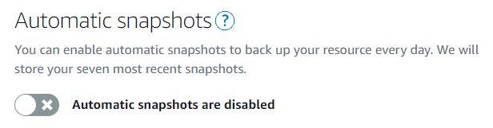
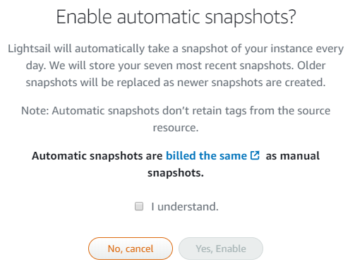
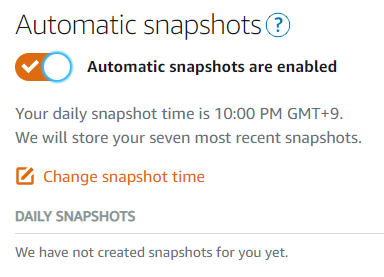
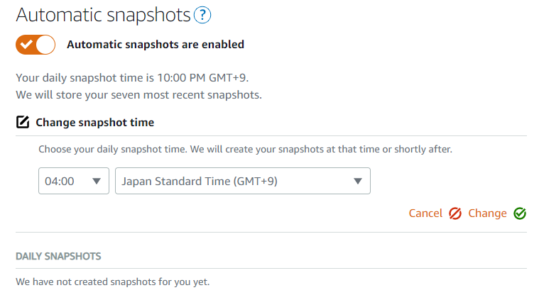

以前、「[AWS Lightsail の snapshot 取得を自動化する](/2019/05/aws-lightsail-auto-snapshots/)」という記事を書きましたが、先日 Lightsail の自動スナップショット管理機能がリリースされました「[Amazon Lightsail now provides automatic snapshots](https://aws.amazon.com/jp/about-aws/whats-new/2019/10/amazon-lightsail-now-provides-automatic-snapshots/)」。日次でスナップショットを取得し、7日分キープしてくれます。

ということで、[lightsail-auto-snapshots](https://github.com/amazon-archives/lightsail-auto-snapshots) を使ってセットアップしたものを削除して、ネイティブの Automatic Snapshots 機能を有効にすることにします。

lightsail-auto-snapshots は CloudFormation を使って CloudWatch Evnets をトリガーに Lambda を実行するようになっているので、CloudFormation のスタックを削除すれば丸っと消すことができます。自動削除も停止してしまうので取得済みの snapshot は別途削除が必要です。

次に Automatic Snapshots を有効にします

#### Lightsail の Snapshots タグにある次のトグルをオンにします

#### 確認ダイアログが表示されるので読んで有効にします

#### 有効になりました

東京リージョンの場合、デフォルトでは日本時間の朝10時に snapshot が取得されるようです

#### 取得時刻は変更可能です

試しに朝4時にしてみます

以上です。簡単ですね
