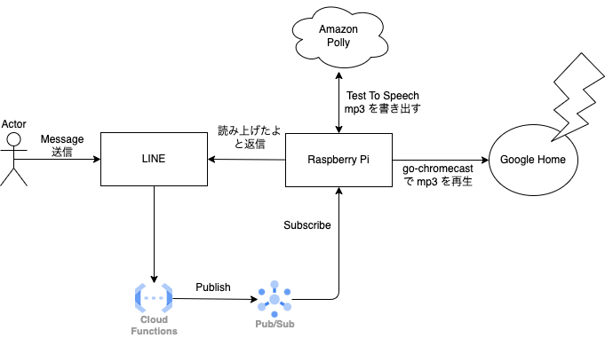

令和の時代、家に固定電話はなく、外出先から家族に直ぐに答えて欲しいことがあってもスマホはマナーモードで手元に置いてなければ気づくことができません。

そんなわけで、外出先から任意のメッセージを Google Home に読み上げさせたいなって思っていました。
いや、Google Home にはまさにその機能があるわけですが、めっちゃ使いづらいんですよね。

以前記事にした [go-chromecast](/2019/10/google-home-mini-and-text-to-speech/) は今も毎朝 S&P 500 の数値を教えてくれているので、今回もこれを使って Text-To-Speech します。

LINE Bot を使えばユーザーインターフェースとして普段から使い慣れている LINE を使うことができます。
LINE Bot は非公開にできないという問題があるのですが、UserID をチェックして知らない人からのメッセージには反応しないことにして回避します。

## 構成図

## LINE Bot 作成準備

LINE Bot は登場間もない頃に一度作って試していたので、初期設定のような手順はもう覚えていませんが、今回は新しく Channel を作成し、Webhook サーバーに必要な `CHANNEL_SECRET` と `CHANNEL_ACCESS_TOKEN` を取得します。

## Google Cloud

Webhook サーバーは Google Cloud の Cloud Functions を使います。
そこで受けたメッセージを Cloud PubSub Topic に Publish すれば、Webhook サーバーの役割は終わりです。簡単。

LINE SDK のリポジトリに example があります

- https://github.com/line/line-bot-sdk-go
- Go で HTTP Cloud Functions の関数を作成してデプロイする  
  https://cloud.google.com/functions/docs/create-deploy-http-go?hl=ja

## 家のサーバー

Google Home にアクセスするために家の中にあるラズパイが Cloud PubSub Topic を Subscribe して、メッセージを受け取ったら Text-To-Speech で音声化して Chromecast で再生します。
go-chromecast はそれ単体で Google の Text-To-Speech を使って音声化してくれるのですが、日本語は発音がイマイチなので [Amazon Polly](https://aws.amazon.com/jp/polly/) の Neural Engine を使ったやつ ([Takumi](https://aws.amazon.com/jp/about-aws/whats-new/2021/12/amazon-polly-takumi-neural-japanese-voice/)) を使うことにしました。

awscli でも簡単に mp3 を作れるのですが、我が家のラズパイは BCM2835 チップの初代っぽく ([kano を DietPi でサーバーにした](2018/03/kano-dietpi/)) くそ遅いので awscli は入れたくも使いたくもないのでそれだけのツールを Go で書きました。と言ってもサンプルがほぼそのまま使えた。Engine を Neural にしたり、細かいところをちょろっといじっただけ。
go-chromecast は mp3 を渡した場合、ffmpeg を必要とするのだが DietPi でも apt で簡単に入って良かった。

- https://docs.aws.amazon.com/sdk-for-go/v1/developer-guide/polly-example-synthesize-speech.html
- https://github.com/awsdocs/aws-doc-sdk-examples/blob/main/go/example_code/polly/pollySynthesizeSpeech.go
- [Amazon Polly が新しい日本語のニューラル音声 (男性) 「Takumi」を導入](https://aws.amazon.com/jp/about-aws/whats-new/2021/12/amazon-polly-takumi-neural-japanese-voice/)

## つぶやき

Raspberry Pi 4 が欲しいのに売ってない、早く供給改善してくれ。[Orange Pi](http://www.orangepi.org/) もうちょい安くなってくれないかな
