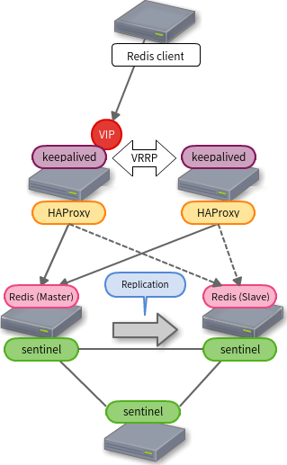
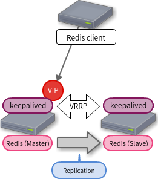

Redis を冗長化したいなって思って探していたらこんなのを見つけたので試してみます。

「[Highly Available Redis Cluster | Simplicity is the keynote of all true elegance](http://www.101tech.net/2014/08/08/highly-available-redis-cluster/)」

最初は Pacemaker で構築しようと考えていましたが Redis の作者様が Sentinel を[おすすめしていた](https://groups.google.com/forum/m/#!msg/redis-db/eY3zCKnl0G0/qvqd0qsX1BkJ)のでこの構成を試してみます。

それぞれのバージョンは

* OS: CentOS 6.6
* Redis: 2.8.19
* HAProxy: 1.5.11
* Keepalived: 1.2.13

図にするとこんな感じ



Redis の Master / Slave は Sentinel でコントロールします。
Sentinel については「[Redis Sentinelで自動フェイルオーバー](http://qiita.com/wellflat/items/8935016fdee25d4866d9)」が詳しいです（ちょっと古いかもしれないけど）。

Redis の Master / Slave 管理は Sentinel がうまいことやってくれますが、Master に VIP を持たせて常に同じ IP アドレスに接続すれば良いということにはできません。この部分をこの構成では HAProxy に委ねています。

HAProxy は Redis サーバー全て（今回の例では Master と Slave の2台）を LB のメンバーとし、ヘルスチェックで Master であることを確認します。
これにより Slave のサーバーは Down している扱いとなり、アクセスを振り分けません。
クライアントが Master の IP アドレスを Sentinel に問い合わせたり、Sentinel が Master の変更をクライアントに通知したりする必要がなくて楽ちんですね。

ただし、気をつけるべきこともあります。それは、うっかり Master として Redis を起動させてしまわないこと。

Master だったサーバーが突然再起動し、Slave が Master に昇格した後、旧 Master がそのまま起動してくると HAProxy がアクセスを振り分けてしまいます。Sentinel が見つければすぐに Slave に変更してくれますが、一時的にであってもアクセスさせたくありません。よって、自動起動を無効にしておくと良いでしょう。（ネットワークの分断とか不安定なネットワークとかを考えるとなかなか簡単ではないかも）

最後に HAProxy の冗長化です。これは keepalived で VRRP を使って Virtual IP を使ってアクセスするようにします。HAProxy はどちらも同じように稼働させておけば良いです。Master だから、Backup だからという役割による変更は不要です。

それではそれぞれの設定です。

### Redis Sentinel

```
port 2379
logfile /var/log/redis/sentinel.log
dir /tmp
sentinel monitor mymaster 192.168.1.20 6379 2
sentinel auth-pass mymaster my-redis-password
sentinel down-after-milliseconds mymaster 30000
sentinel parallel-syncs mymaster 1
sentinel failover-timeout mymaster 180000
# sentinel notification-script mymaster /var/redis/notify.sh
# sentinel client-reconfig-script mymaster /var/redis/reconfig.sh
````

mymaster` の名称は任意の文字列で指定できます。また、複数設定することもできます。`mymaster1` と `mymaster2` など。ということは1組の Sentinel で複数の Redis Cluster を管理できるということです。 Sentinel は Master から Slave の情報を取得するため、Master を指定するだけです。

### HAProxy

```
global
    log 127.0.0.1 local2 notice
    maxconn 4096
    chroot /var/lib/haproxy
    user nobody
    group nobody
    daemon

defaults
    log global
    mode tcp
    retries 3
    option redispatch
    maxconn 2000
    timeout connect 2s
    timeout client 120s
    timeout server 120s

frontend redis
    bind :6379
    default_backend redis_backend

backend redis_backend
    option tcp-check
    tcp-check send AUTH\ my-redis-password\r\n
    tcp-check expect string +OK
    tcp-check send PING\r\n
    tcp-check expect string +PONG
    tcp-check send INFO\ REPLICATION\r\n
    tcp-check expect string role:master
    tcp-check send QUIT\r\n
    tcp-check expect string +OK
    server redis1 192.168.1.21:6379 check inter 1s
    server redis2 192.168.1.22:6379 check inter 1s
```

`tcp-check` の `send` で送る文字列を `expect` で期待する応答にマッチする文字列を指定しています。書いてある順に1つの TCP セッションで実行されます（スペースの前にはバックスラッシュが必要です）。`AUTH パスワード` でパスワードを送り、応答に `+OK` が含まれていたら `PING` を送り、応答に `+PONG` が含まれていたら `INFO REPLICATION` を送り `role:master` が含まれていたら OK。生きた Master であると確認できます。認証が不要ならその部分は不要で `PING` から始めれば良いです。

### keepalived

multicast で packet 垂れ流すのもよくないので unicast で設定しています。

```
global_defs {
    notification_email {
        admin@example.com
    }
    notification_email_from keepalived@example.com
    smtp_server 127.0.0.1
    smtp_connect_timeout 30
    router_id ホスト名
}

vrrp_script check_haproxy {
    script "pkill -0 -x haproxy" # haproxy というプロセスの存在確認
    interval 1  # 1秒おきに実行
    fall 2      # 2回続けてのの失敗でダウンと判断
    raise 2     # 2回成功で正常と判断
}

vrrp_instance REDIS {
    state BACKUP   # nopreempt のため2台とも BACKUP とする
    interface eth0
    smtp_alert
    virtualrouter_id 51     # 同一サブネット内で一意な数字
    priority  101           # 数字の大きい方が Master
    advert_int 1            # VRRP パケットの送信間隔
    nopreermpt              # 自動 fail back しない
    unicast_peer {          # multicast でなく unicast で ok
        192.168.1.32        # 相方のアドレスを指定
    }
    authentication {
        auth_type PASS
        auth_pass hogehoge  # 8文字までの文字列
    }
    virtual_ipaddress {
        192.168.1.30        # VIP
    }
    track_script {
        check_haproxy
    }
    # Master への昇格時に実行するスクリプト (ただし、今回の構成ではなにもする必要がない)
    # notify_master /some/where/notify_master.sh
}
```

### でもちょっと大げさ？

ここまでの構成を1発で構築できる Ansible playbook を書いたものの、これはちょっと大げさじゃないか？と思えてきました。
今回欲しいのはただの Active / Standby 構成でした。

Sentinel を有効活用し、Redis の Replica を増やして負荷を分散すると（効果的かどうかは謎）か、1つの HAProxy の対で複数の Redis Cluster を管理する（Sentinel も1組で良い）とかやりたい場合は良い構成であるきがするものの、単純な Active / Standby としては大げさです。

また、せっかく高速な Redis を使うのに間に HAProxy を入れると少なからずオーバーヘッドがあります。

redis-benchmark で簡単に試してみたところ[半分くらいのパフォーマンス](https://gist.github.com/yteraoka/049e06bed2cb0d36865f#file-rps-md)になることもありました（元が速いのでそれでも速いとは思います）。
で、HAProxy 外しちゃばいいんじゃないかと考えたら、そうすると keepalived で VIP を持った方が必ず Redis の Master になる必要があり、Redis Sentinel に管理させるわけにはいかなくなりました。

結局 keepalived が master に昇格した際にそのホストの Redis を Master に切り替えるという構成になります。



「[RedisをKeepalivedでフェイルオーバーする構成案 - 酒日記 はてな支店](http://sfujiwara.hatenablog.com/entry/20120802/1343880266)」になるってことです。
fujiwara さんが書かれた頃はまだ keepalived で unicast の VRRP がサポートされてなかったようですが今では unicast が使えるので EC2 などのクラウドサービスでも使えそうです。
keepalived の `notify_master` で Redis を Master に昇格 `redis-cli slaveof no one` させ、変更を redis.conf に反映 `redis-cli config rewrite` させます。
[CONFIG REWRITE](http://redis.io/commands/config-rewrite) は 2.8 で追加されたコマンドなのでこれも fujiwara さんの記事の時点ではなかった機能ですね。
`notify_backup` を使えば BACKUP に切り替わった際に Redis を slave にするということもできます。

```
global_defs {
    notification_email {
        admin@example.com
    }
    notification_email_from keepalived@example.com
    smtp_server 127.0.0.1
    smtp_connect_timeout 30
    router_id ホスト名
}

vrrp_script check_redis {
    script "/some/where/check_redis.sh" # redis のどうさ確認スクリプト
    interval 2  # 2秒おきに実行
    fall 2      # 2回続けてのの失敗でダウンと判断
    raise 2     # 2回成功で正常と判断
}

vrrp_instance REDIS {
    state BACKUP   # nopreempt のため2台とも BACKUP とする
    interface eth0
    smtp_alert
    virtualrouter_id 51     # 同一サブネット内で一意な数字
    priority  101           # 数字の大きい方が Master
    advert_int 1            # VRRP パケットの送信間隔
    nopreermpt              # 自動 fail back しない
    unicast_peer {          # multicast でなく unicast で ok
        192.168.1.32        # 相方のアドレスを指定
    }
    authentication {
        auth_type PASS
        auth_pass hogehoge  # 8文字までの文字列
    }
    virtual_ipaddress {
        192.168.1.30        # VIP
    }
    track_script {
        check_redis
    }
    # Master への昇格時に実行するスクリプト
    notify_master /some/where/notify_master.sh
    # notify_backup /some/where/notify_backup.sh
}
```

シンプルだし、Active / Standby 構成ならこっちですね。
