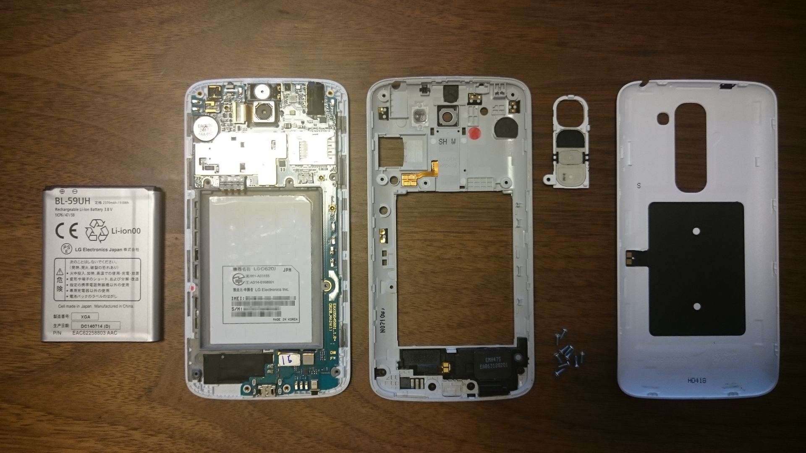

私のスマホは [Xperia Z3 (SO-01G)](/2015/05/switch-from-lg-g2-mini-to-so-01g/) に乗り換えたので息子のおもちゃと化していた [LG G2 mini](/2014/10/lg-g2-mini-with-bic-sim/) ですが、あの変な場所（背面）についている電源とボリュームの機械スイッチが効かなくなってしまったので特殊ドライバー（[アネックス(ANEX) 特殊精密差替ドライバーY型 No.3607](https://amzn.to/3CI0Qep) を購入して分解してみました。（水没歴あり）

ちょいと掃除してあげたら（？）スイッチは復活しました。めでたしめでたし。
