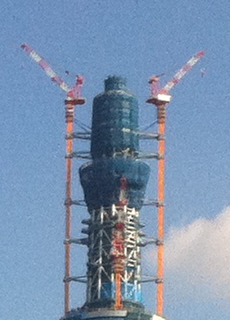

画像を表示場所に合わせていろいろなサイズで表示したいという要件は良くあるようで「[画像変換Night](http://connpass.com/event/11516/presentation/)」というイベントが開催されるほどのようです。

* [ngx\_small\_light](https://github.com/cubicdaiya/ngx_small_light) (nginx)
* [mod\_small\_light](https://code.google.com/p/smalllight/) (Apache)
* [Graid](https://github.com/violetyk/graid) (golang)
* [go-thumber](https://github.com/pixiv/go-thumber) (golang)

今回は、こういった用途でもつかえる [thumbor](http://thumbor.org/) を紹介します。

* [https://github.com/thumbor/thumbor](https://github.com/thumbor/thumbor)
* [https://github.com/thumbor/thumbor/wiki](https://github.com/thumbor/thumbor/wiki)

### thumbor の概要

thumbor は python で書かれた画像のオンデマンド変換 HTTP サーバーです (Python 2.7, 3.2 をサポート)  
[Tornado](http://www.tornadoweb.org/en/stable/) という非同期処理のフレームワークが使われています。画像変換は Proxy サーバーのような動作をするので非同期処理が良いようです。

* 画像のアップロードにも対応しています
* 画像変換ライブラリ（エンジン）を次の3つから選べます
  * PIL (Python Image Library)
  * GraphicsMagick (pgmagick)
  * OpenCV
* 多くのフィルターがかけられます
* OpenCV を使えば顔認識などでうまいことクロップできます
* セキュリティ対策できています

[クライアントライブラリ](https://github.com/thumbor/thumbor/wiki/Libraries)なども各言語用がそろっています ChangeLog 的なものがないのがちと辛いですが、結構更新されています。 今回 thumbor-url のバグを報告しましたがすぐに対応してもらえてました。

### thumbor は誰が使っている？

[Who's using it](https://github.com/thumbor/thumbor/wiki/Who%27s-using-it) に書かれていますが私のよく知らないサイトですね...

### 実行例

オリジナル画像として [これ](IMG_0516.jpg) (2592x1936) を使います。 まずは縦横比を維持したままで、縦と横どちらかを指定のサイズに合わせる方法です。

#### 縦横比を維持して横幅を 300px にする

`http://thumbor/unsafe/300x0/https://blog.1q77.com/wp-content/uploads/2015/04/IMG_0516.jpg`


#### 縦横比を維持して高さを 300px にする

`http://thumbor/unsafe/0x300/https://blog.1q77.com/wp-content/uploads/2015/04/IMG_0516.jpg`


縦横比を維持する場合には後で出てくる `fit-in` が便利です。


#### 縦横を指定のサイズに切り詰める 300x100

`http://thumbor/unsafe/300x100/https://blog.1q77.com/wp-content/uploads/2015/04/IMG_0516.jpg`


#### サイズ変更に加え、グレイスケールに変換する

`http://thumbor/unsafe/400x200/filters:grayscale()/https://blog.1q77.com/wp-content/uploads/2015/04/IMG_0516.jpg`


#### 輝度を変える

`http://thumbor/unsafe/200x200/filters:brightness(-20)/https://blog.1q77.com/wp-content/uploads/2015/04/IMG_0516.jpg`


`http://thumbor/unsafe/200x200/filters:brightness(40)/https://blog.1q77.com/wp-content/uploads/2015/04/IMG_0516.jpg`


#### 指定の場所を切り取る

`http://thumbor/unsafe/1520x330:1750x650/https://blog.1q77.com/wp-content/uploads/2015/04/IMG_0516.jpg`



こんな感じでオンデマンドに画像のリサイズやクロップ、フィルタ適用が可能です。 URL 体系はこちらにあります。
[https://github.com/thumbor/thumbor/wiki/Usage](https://github.com/thumbor/thumbor/wiki/Usage)

### URLの生成

アプリで動的にリンクを作成する場合であれば、それぞれの言語のライブラリのドキュメントを参照してください。 thumbor をインストールするとURL生成のためのコマンドラインツールもインストールされています。 `/opt/thumbor` に [virtualenv](https://virtualenv.pypa.io/en/latest/) でインストールしたとすると `/opt/thumbor/bin/thumbor-url` にあります。 4.9 以降、構成変更があって thumbor-url が期待通りに動作しなくなっていました。リリースされていたら 5.0.2 以降を使ってください。 URL は体系は [https://github.com/thumbor/thumbor/wiki/Usage](https://github.com/thumbor/thumbor/wiki/Usage) にあります。

```
$ /opt/thumbor/bin/thumbor-url -h
Usage: thumbor-url [options] imageurl or type thumbor-url -h (--help) for help

Options:
  --version             show program's version number and exit
  -h, --help            show this help message and exit
  -l KEY_FILE, --key_file=KEY_FILE
                        The file to read the security key from [default:
                        none].
  -k KEY, --key=KEY     The security key to encrypt the url with [default:
                        none].
  -w WIDTH, --width=WIDTH
                        The target width for the image [default: 0].
  -e HEIGHT, --height=HEIGHT
                        The target height for the image [default: 0].
  -n, --fitin           Indicates that fit-in resizing should be performed.
  -m, --meta            Indicates that meta information should be retrieved.
  --adaptive            Indicates that adaptive fit-in cropping should be
                        used.
  --full                Indicates that fit-full cropping should be used.
  -s, --smart           Indicates that smart cropping should be used.
  -t, --trim            Indicate that surrounding whitespace should be
                        trimmed.
  -f, --horizontal-flip
                        Indicates that the image should be horizontally
                        flipped.
  -v, --vertical-flip   Indicates that the image should be vertically flipped.
  -a HALIGN, --halign=HALIGN
                        The horizontal alignment to use for cropping [default:
                        center].
  -i VALIGN, --valign=VALIGN
                        The vertical alignment to use for cropping [default:
                        middle].
  --filters=FILTERS     Filters to be applied to the image, e.g.
                        brightness(10) [default: ].
  -o, --old-format      Indicates that thumbor should generate old-format urls
                        [default: False].
  -c CROP, --crop=CROP  The coordinates of the points to manual cropping in
                        the format leftxtop:rightxbottom (100x200:400x500)
                        [default: none].
```

#### resize

`-w WIDTH` と `-e HEIGHT` で縦横のピクセル数を指定します。 これだけでだと縦と横の大きい方のサイズに拡大縮小され、小さい方に合わせてはみ出した部分が削れれます。

```
$ thumbor-url -w 100 -e 100 https://blog.1q77.com/wp-content/uploads/2015/04/IMG_0516.jpg
```

#### fit-in

`--fitin` をつけると指定した縦横からはみ出ないように縦横比を維持したままリサイズされます。 800x600 の画像を fit-in で 300x300 にすると 300x225 にリサイズされます。 ただし、fill フィルターを追加すると 300x300 になり、上下の空きスペースは指定の色で埋められます。 `filters:fill(red)` で上下に赤いエリアがつきます。


#### full-fit-in

`--fitin` に `--full` を追加すると、指定のサイズの小さい方に合わせてリサイズし、縦横比を維持するため大きい方は指定のサイズを超えます。 URL の `fit-in/` 部分が `full-fit-in/` になります。サーバー側は機能します。 800x600 の画像を full-fit-in で 300x300 にすると 400x300 になります。

#### crop

`-c W1xH1:W2xH2` 画像内の2点を指定して四角く切り抜きます。

#### crop and resize

`-c` と `-w`, `-e` を組み合わせると、crop で切り抜いた部分をさらにリサイズします。

#### trim

画像の縁の空白を削ります。

#### filters

`--filters=FILTERS` でグレースケールや輝度、コントラストの変更、ぼかし、回転などが利用できます。 [Available Filters](https://github.com/thumbor/thumbor/wiki/Filters) `--filters='blur(6)'` この `--filters` オプションも 4.9 以降では正しく動作しません。（5.0.0現在） filters と複数形になっているように URL では `filters:grayscale():blur(6):fill(red)` と複数組み合わせることができます。


#### \-a HALIGN, --halign=HALIGN

サイズを切り詰める際に左右、中央のどこに寄せるかを指定します

#### \-i VALIGN, --valign=VALIGN

サイズを切り詰める際に上下、中央のどこに寄せるかを指定します

### OpenCV を使った顔検出

[opencv-engine](https://github.com/thumbor/opencv-engine) を使った場合、focal-point detection が使えます。「[フォーカルポイント](http://ja.wikipedia.org/wiki/%E3%83%95%E3%82%A9%E3%83%BC%E3%82%AB%E3%83%AB%E3%83%9D%E3%82%A4%E3%83%B3%E3%83%88) (wikipedia)」 これは画像のリサイズ、切り取りの際に顔や注目ポイントを見つけ出して、いい感じに切り出してくれる機能です。 「Facial Detection」と「Feature Detection」があり、まず顔検出を試み、見つからなければ特徴から良さげなところを切り取ってくれます。 使い方は簡単、URLに `smart` を入れるだけです。詳細は [Detection algorithms](https://github.com/thumbor/thumbor/wiki/Detection-algorithms) で。 こちらも確認してください

* [Enabling detectors](https://github.com/thumbor/thumbor/wiki/Enabling-detectors)
* [Available detectors](https://github.com/thumbor/thumbor/wiki/Available-detectors)

顔検出は非常に重い処理であるため、[Lazy detection](https://github.com/thumbor/thumbor/wiki/Lazy-detection) が推奨されています。処理を Redis や AWS SQS の Queue に入れてひとまず顔検出なしで結果を返した後に処理します。この場合、画像のキャッシュに気をつける必要があります。

### Security

`thumbor-url` を試した方は気になったかもしれませんが、このコマンドで生成される path の先頭に謎のハッシュ値が含まれています。

```
# /opt/thumbor/bin/thumbor-url -w 100 -e 50 http://example.com/example.jpg
URL:
/wFTrGO1ExNalW1qwgnQC5HZijv4=/100x50/http://example.com/example.jpg
/wFTrGO1ExNalW1qwgnQC5HZijv4=/100x50/http://example.com/example.jpg
```

これが thumbor のセキュリティ機能です。thumbor の設定ファイルに `SECURITY_KEY` という設定があり、これと `/100x50/http://example.com/example.jpg` を使って SHA1-HMAC を計算した値です。

```python
base64.urlsafe_b64encode(hmac.new(SECURITY_KEY, unicode(URL).encode('utf-8'),
                         hashlib.sha1).digest())
```

サーバーはこの値を確認して不正なリクエストを処理しないようにします。 これまで `unsafe` という特殊な値を使っていましたが、本番サーバーでは `ALLOW_UNSAFE_URL` を `False` にして無効にするべきです。

```
ALLOW_UNSAFE_URL = False
SECURITY_KEY = 'd4dHBbcGDJf6GetnHNRc5MBNntAEgGC4'
````

thumbor-url` では `-l` か `-k` で指定します。

```
  -l KEY_FILE, --key_file=KEY_FILE
                        The file to read the security key from [default: none].
  -k KEY, --key=KEY     The security key to encrypt the url with [default: none].
```

[https://github.com/thumbor/thumbor/wiki/Security](https://github.com/thumbor/thumbor/wiki/Security) 設定ファイルの `ALLOWED_SOURCES` に元画像サーバーのドメインの許可リストを設定し、特定のサーバーの画像のみを対象とすることもできます。

### 続きは後日

pgmagick の compile で異常にメモリを使われ OOM Killer で異常終了していることになかなか気づかずハマってしまったり、thumbor-url のバグを調べたり、Python 2.6 のサポートが終わってたりしてここまで異常に時間がかかってしまい、疲れたので続きはまた後日書くことにします。 画像のアップロードとかキャッシュや結果の保存、セットアップや構成などについて調べて書ければと。

### 試し方

[Ansible の Playbook](https://github.com/yteraoka/thumbor-playbook) を用意したので CentOS / RHEL なかたはこれで構築できます。 debian や ubuntu なら apt で入れられるらしい。 ansible でセットアップすると supervisor 管理下の thumbor へ nginx から proxy する環境が構築されます。 unsafe でアクセスできます。必要であれば `thumbor.yml` の `thumbor_allow_unsafe_url` を `"False"` にしてください。 `thumbor_secure_key` も変更してください。 次はいつ書けるかな
