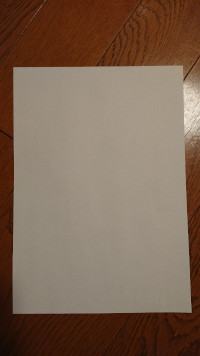

### 機種選定

[2015年の4月頃に Xperia Z3 に乗り換えた](/2015/04/switch-from-lg-g2-mini-to-so-01g/)ようなので2年半ちょいでしたが、もはやソフトウェアの更新もされないし、バッテーリーのヘタリがひどいのでそろそろ買い替え時だなと、次の機種はどれにしようかなと、32GB の内蔵ストレージでは辛くなってるので 64GB は欲しい。しばらく悩んだ末に G8232 に決めました。

[HUAWEI Mate 10 Pro](http://consumer.huawei.com/jp/phones/mate10-pro/) はいいなと思ったけれども高い、[HUAWEI P10 Plus](http://consumer.huawei.com/jp/phones/p10-plus/) も高い、[HUAWEI P10 lite](http://consumer.huawei.com/jp/phones/p10-lite/) はちょっと物足りない。[Zenfone 4](https://www.asus.com/jp/Phone/ZenFone-4-ZE554KL/)、[Moto Z2 Play](https://www.motorola.co.jp/products/moto-z-play-gen-2) は店頭で触ってみてなんだかしっくりこなかった。[Galaxy S8](http://www.galaxymobile.jp/galaxy-s8/)、[Galaxy Note8](http://www.galaxymobile.jp/galaxy-note8/) も高い

Android はソフトウェアのサポート期間が短いのが辛い感じなのであまり高いのは避けたい。致命的な脆弱性を放置されるのは問題だと思いつまでもサポートするわけにはいかないのは分かるが脆弱性があるよっていう表示くらいは必要じゃないか？買い替えてもらうためにも。

Z3 は新古を3万円弱で買ったのだけれども、今はこの価格帯で欲しいものがなかった。調べているうちに Xperia の海外モデルがなかなかリーズナブルだと気づいて [EXPANSYS](http://www.expansys.jp/mobile-phones/sim-free-phones/brand/sony/) にたどり着くと2万円台から4万円台でなかなか悪くなさそうなのが購入できそうでした。

* [Sony Xperia XZs Dual G8232](http://www.expansys.jp/sony-xperia-xzs-dual-g8232-sim-64gb-ice-blue-300351/) Snapdragon 820 / 4GB / 64GB ([spec](https://www.gsmarena.com/sony_xperia_xzs-8599.php#g8232))
* [Sony Xperia XA1 Ultra Dual G3226](http://www.expansys.jp/sony-xperia-xa1-ultra-dual-g3226-64gb-gold-302082/) Mediatek P20 / 4GB / 64GB ([spec](https://www.gsmarena.com/sony_xperia_xa1_ultra-8595.php#g3226))
* [Sony Xperia X Dual F5122](http://www.expansys.jp/sony-xperia-x-unlocked-32gb-white-288280/) Snapdragon 650 / 3GB / 64GB ([spec](https://www.gsmarena.com/sony_xperia_x-7948.php#f5122))
* [Sony Xperia XZ Dual F8332](http://www.expansys.jp/sony-xperia-xz-dual-f8332-64gb-platinum-294029/) Snapdragon 820 / 3GB / 64GB ([spec](https://www.gsmarena.com/sony_xperia_xz-8313.php#f8332))

Ultra の画面サイズにはちょっと惹かれるものの、2cm 長くなるのはちょっと長すぎる気がするし、本を呼んだりするのには横幅の方が欲しい、長く使うなら CPU もやっぱり高性能が良いなということで結局 XZs (G8232) にしました。

実際の購入は [ETOREN](https://jp.etoren.com/collections/xperia-xzs) で US$415 + 送料 US$18 でした。



### Z3 の使いみち

[Z3 の詳細スペック](https://www.gsmarena.com/sony_xperia_z3-6539.php) （実際には docomo の SO-01G だからちょっと違うかも）  
SO-01G はフルセグ視聴が可能なのでポータブルTV端末としてしばらくたまに使うと思う。

### 使ってみて

正直、見た目や持った感じはほぼ同じなのでワクワク感は全然ない。  
Android が 6 から 7.1 に更新されたことで通知まわりが大きく変わっていたことに驚いた程度。

Android 8 Oreo はいつになったら降ってくるのかな？？

### カメラ比較（静止画）









XZs はちょっとシャープネスフィルタがかかったような感じでかつ、ちょっと歪みがあるようにみえる。歪みの方はソフトウェア・アップデートで改善されるとか。

新しい機能「[先読み撮影](http://www.sonymobile.co.jp/myxperia/howtoxperia/camera/function30.html)」はシャッターを切るちょっと前のデータも持っていることから動く被写体については最大4枚保存される

[シャッタースピード調整](http://www.sonymobile.co.jp/myxperia/howtoxperia/camera/function28.html) は良さそう。

#### 歪みの確認

Z3

XZs

### 動画 スーパースロー

> Xperia XZs / XZ Premiumから搭載された「スーパースロー」は、通常スピード（1秒30コマ）の映像に約6秒間のスローモーション映像（1秒最大960コマ）を組み合わせることで、緩急のある映像が簡単に作成できます。
> 
> 通常のビデオ撮影中、スローモーションで残したい瞬間にスローボタンをタップすると、約0.2秒の一瞬を約6秒のスローモーション映像として記録。

[http://www.sonymobile.co.jp/myxperia/howtoxperia/camera/function29.html](http://www.sonymobile.co.jp/myxperia/howtoxperia/camera/function29.html)

この機能はちょっとおもしろいかなと思うけど、0.2秒のタイミングを合わせるのが至難の業かなと。ずっと回ってるハンドスピナーやずっと流れてる噴水を取ってみた。ボールを投げたり、ハトが飛び立つところを取ってみたかったけど簡単ではなさそうだったので諦めた。  
  
120fps であれば普通に撮影した後で任意の箇所をスローにすることができるのでこっちの方が使いやすいかも

### バッテリー

2年半使った Z3 はもう全然持たなくなってたので劇的改善を期待していたのだが、これは期待外れだった。毎日充電は必須だし心配ならモバイルバッテリー持ち歩けってことなんだろうな。

### アクセサリ

ケースやフィルムなど買ってみたものを紹介

#### フィルム

フィルムは「[Timkyo Xperia XZsフィルム 3D曲面 全面保護 硬度9H ソニー エクスペリア XZ 強化ガラスフィルム 品質保証](http://amzn.to/2m3W7eB)」で、超薄型0.26mmって書いてあるけどこれまで使ってきたフィルムとは違ってだいぶ厚い。これってフィルムって呼ぶの？って感じ。3Dラウンドエッジでなんとなく Galaxy っぽい感じになる。触り心地は良いですが、端はほんの少し浮き気味でタッチしづらいことはある。





縁のところにホコリが入っちゃうのがマイナスポイント  
もう一度買うかと言われると買わない  
ベッドから落とした際にパコって外れちゃったので捨てました。フィルム(?)なんて要らんかったんや！！

#### ケース

ケースは「[Willnorn Xperia XZs ケース シリコン TPU クリア バンパー 耐衝撃 落下防止 アクリル板背面 擦り傷防止 透明 XZs XZ 適用 スマホカバー (クリア)](http://amzn.to/2F3HKzw)」で透明のしっかりしたシリコンケースで安心感があります。電源ボタンが指紋センサーを兼ねているため、ここの穴があまり大きくないのが影響してちょっと指紋認証しづらいところがマイナスポイント。意図せず、分厚いフィルムといい感じにマッチしてる。一体感がある。





#### Type-C ケーブル

所持端末初の USB 端子が Type-C なのでケーブルも購入しました。（本体付属で1本はついてきます）  
「[Anker PowerLine+ USB-C & USB-A 3.0 ケーブル (0.9m レッド) Galaxy S8 / S8+、MacBook、Xperia XZ対応](http://amzn.to/2F6Hf7J)」  
Anker が安心感があるかなと。

0.9m で 899円なのにオサレなスウェードケースまで付いててびっくりしました。ケースの USB 端子部の穴が小さいのでちょっと挿しづらいけど使えないわけではない。





Apple が電池交換値下げしたし、型落ち iPhone 狙って更新していくのがよい気がする

* * *

はぁぁぁ、待ちに待ちましたよ。年末に購入して3月7日にやっと Android Oreo が降ってきましたよ。静止画歪み補正機能がやっと手に入った。

* * *
